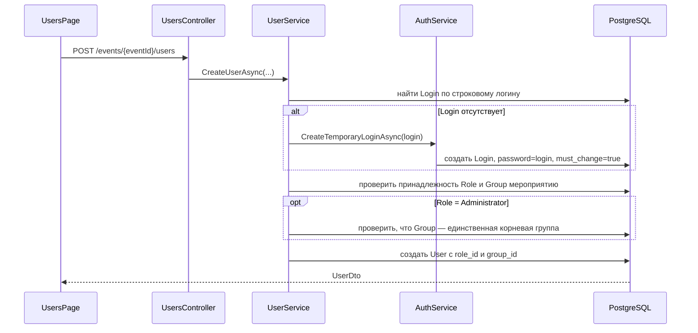
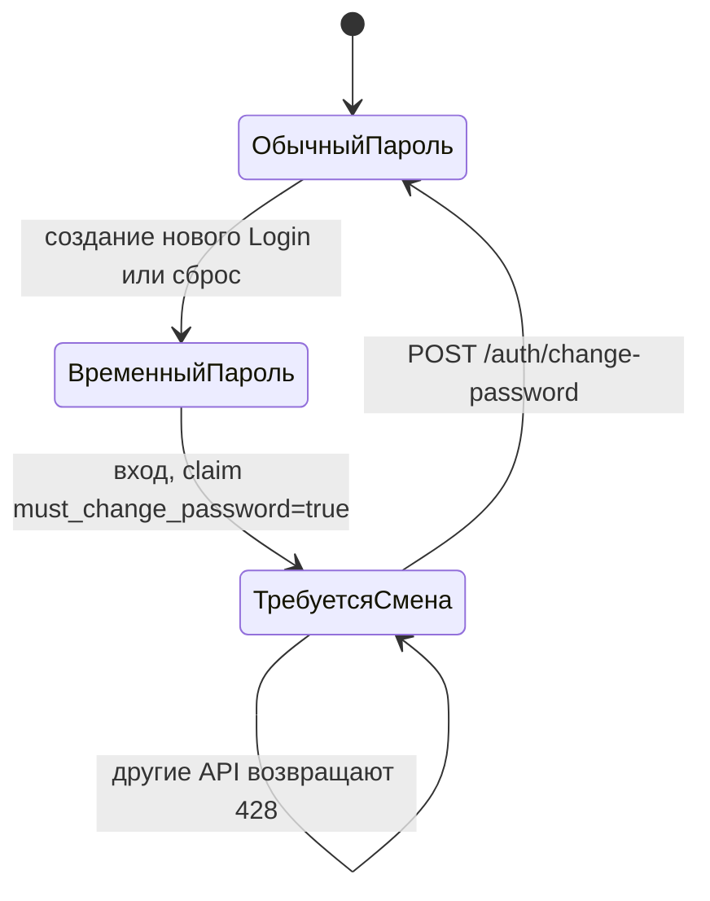

# Вкладка «Сотрудники»: пользовательская логика и архитектура

Документ описывает текущее поведение функциональности сотрудников в контексте мероприятия. Он состоит из двух частей:

1. инструкция и правила для пользователя системы;
2. техническое описание для разработчика.

Термины:

- **Login** — глобальная учётная запись с логином, паролем и признаком обязательной смены пароля;
- **User / сотрудник** — профиль Login внутри конкретного мероприятия с ФИО, ролью и группой;
- один Login может иметь по одному User в нескольких мероприятиях.

---

# Часть 1. Для пользователя системы

## 1. Когда доступна вкладка

Вкладка **«Сотрудники»** отображается только после загрузки профиля текущего пользователя и при наличии разрешения `create_user` в выбранном мероприятии.

Стандартные роли получают доступ следующим образом:

| Роль | Доступ к сотрудникам |
|---|---|
| `Administrator` | Да, потому что стандартный администратор получает все разрешения |
| `Manager` | Нет по умолчанию |
| `Approver` | Нет по умолчанию |
| Пользовательская роль | Да, если роли назначено разрешение `create_user` |

Прямой переход по адресу `/events/{eventId}/users` также защищён проверкой `create_user` на фронтенде. До смены временного пароля все защищённые страницы, включая сотрудников, недоступны.

## 2. Список сотрудников

Таблица показывает сотрудников текущего мероприятия. В ней отображаются:

- ФИО;
- email;
- телефон;
- роль;
- группа;
- дата создания;
- иконки редактирования, сброса пароля и удаления.

Логин не выводится отдельной колонкой, но загружается с сервера и показывается в форме редактирования.

Если сотрудников нет, отображается пустое состояние. При ошибке загрузки показывается сообщение об ошибке.

## 3. Создание сотрудника

Кнопка **«Создать сотрудника»** доступна при наличии разрешения `create_user`.

Форма содержит поля в следующем порядке:

| Поле | Обязательное | Поведение |
|---|---:|---|
| Фамилия | Да | Текстовое поле |
| Имя | Да | Текстовое поле |
| Отчество | Нет | Текстовое поле |
| Email | Да | Проверяется браузером как email |
| Логин | Да | Изначально автоматически повторяет email |
| Телефон | Нет | Поле типа `tel` |
| Роль | Да | Выпадающий список ролей мероприятия; отправляется ID роли |
| Группа | Да | Выпадающий иерархический список групп; отправляется ID группы. Для `Administrator` автоматически выбирается корневая группа |

### Синхронизация email и логина

Пока пользователь не изменил логин вручную, изменение email автоматически обновляет логин. После первой ручной правки логин становится независимым от email.

### Роли и группы

При открытии формы роли и группы загружаются параллельно. По умолчанию выбираются первые доступные роль и группа. Создание недоступно, пока справочники загружаются или если хотя бы один из них пуст.

Если выбрана роль с именем `Administrator` без учёта регистра:

- автоматически выбирается единственная корневая группа мероприятия;
- поле группы блокируется;
- выбрать дочернюю группу нельзя;
- после смены роли на другую поле группы снова становится доступным.

Это правило проверяется повторно на backend. Роль и группа также должны принадлежать текущему мероприятию.

### Учётная запись и временный пароль

При создании сотрудника backend ищет глобальный Login по введённому логину.

- Если Login не существует, он создаётся автоматически.
- Временный пароль нового Login равен его логину.
- Для нового Login устанавливается обязательная смена пароля.
- Если Login уже существует, он повторно используется. Его текущий пароль и признак смены пароля автоматически не сбрасываются.

После успешного создания таблица сотрудников загружается повторно.

## 4. Редактирование сотрудника

Редактирование открывается по иконке карандаша.

Можно изменить:

- фамилию;
- имя;
- отчество;
- email;
- логин;
- телефон;
- роль;
- группу.

Логин обязателен и доступен для редактирования. Он относится к общей учётной записи `Login`: если один человек участвует в нескольких мероприятиях через тот же `Login`, новое имя входа действует во всех этих мероприятиях. Для учётной записи с временным паролем после переименования временный пароль автоматически становится равен новому логину; обычный установленный пароль не меняется.

При выборе роли `Administrator` группа автоматически меняется на корневую и блокируется. Чтобы назначить другую группу, сначала нужно выбрать другую роль.

Администратору доступен полный список ролей выбранного мероприятия. Роль единственного сотрудника с ролью `Administrator` нельзя заменить на другую: сначала нужно назначить `Administrator` ещё одному сотруднику. Ограничение действует и в интерфейсе, и на backend.

Фамилия, имя, email, логин, роль и группа обязательны. После сохранения список загружается повторно.

## 5. Сброс пароля

Сброс выполняется по иконке ключа/сброса в строке сотрудника.

Последовательность:

1. открывается модальное окно приложения;
2. пользователь подтверждает действие кнопкой **«Да, сбросить»** или отменяет кнопкой **«Нет»**;
3. пароль Login устанавливается равным логину;
4. включается обязательная смена пароля;
5. модальное окно сообщает, что временный пароль равен логину сотрудника, но не выводит значение пароля отдельно.

Сброс относится к глобальному Login. Если один Login связан с несколькими мероприятиями, пароль меняется для входа во все эти мероприятия.

Уже открытые сессии сотрудника не прерываются. Требование смены пароля начинает действовать при следующем входе, потому что соответствующий признак включается в новый SID при авторизации.

## 6. Первый вход и смена временного пароля

При входе с временным паролем пользователь перенаправляется на `/change-password`.

До смены пароля backend блокирует остальные авторизованные API ответом HTTP `428 Precondition Required`. Фронтенд также перенаправляет защищённые маршруты на страницу смены пароля.

Пользователь вводит:

- текущий временный пароль;
- новый пароль длиной не менее 8 символов;
- подтверждение нового пароля.

После успешной смены:

- признак обязательной смены отключается;
- backend выдаёт новый SID;
- профиль выбранного мероприятия загружается заново;
- пользователь переходит на дашборд без повторного входа.

## 7. Удаление сотрудника

Удаление выполняется по иконке корзины. Открывается модальное окно приложения с именем сотрудника, предупреждением о необратимости операции и кнопками **«Нет»** и **«Да, удалить»**. Во время запроса модалку нельзя закрыть.

Удалить единственного сотрудника с ролью, имя которой равно `Administrator` без учёта регистра, нельзя. Ограничение проверяется и на фронтенде, и на backend.

Если администраторов несколько, проверка единственного администратора удаление не запрещает. Однако сотрудник может не удалиться по другим ограничениям базы данных, например если он является владельцем мероприятия или создателем связанных записей с ограничением `Restrict`.

Удаление User не удаляет глобальный Login. Учётная запись может сохраниться без профиля в этом мероприятии.

## 8. Адаптивность

Формы создания и редактирования:

- на широком экране используют две колонки;
- на экранах до 640 px переходят в одну колонку;
- кнопки на мобильных располагаются вертикально;
- таблица находится в прокручиваемом контейнере.

---

# Часть 2. Для разработчика

## 1. Общая модель

```text
Login (глобальная учётная запись)
  ├── login
  ├── password_hash
  ├── must_change_password
  └── Users[]
        └── User (профиль в мероприятии)
              ├── event_id
              ├── role_id
              ├── group_id
              ├── ФИО / email / телефон
              └── созданные гости / владение мероприятиями
```

Уникальный индекс `(login_id, event_id)` не позволяет создать два профиля одного Login в одном мероприятии. Один Login может иметь профили в разных мероприятиях.

Связи User с Role и Group обязательны. Удаление Role и Group при наличии пользователей ограничено через `DeleteBehavior.Restrict`. Для роли `Administrator` сервис требует единственную корневую группу мероприятия (`ParentGroupId == null`).

## 2. Основные потоки

### Создание



### Сброс и смена пароля



## 3. Права доступа

Разрешение управления сотрудниками — `create_user`.

### Фронтенд

- `EventSettingsPage` показывает вкладку только при `currentUser.permissions.includes("create_user")`; значение по умолчанию при отсутствии профиля — `false`.
- `App.tsx` оборачивает маршрут в `ProtectedRoute requiredPermission="create_user"`.
- `UsersPage` не загружает список и не показывает кнопку, если разрешения нет.
- `ProtectedRoute` раньше проверки разрешения проверяет токен и `mustChangePassword`.

### Backend

`CanCreateUser` зарегистрирована в `WebApi/Program.cs` как `PermissionRequirement("create_user", requiresGroup: true)`.

Политикой защищены:

- создание;
- обновление;
- сброс пароля;
- удаление.

Текущий `GET /users` защищён только `[Authorize]`, без `CanCreateUser`. Поэтому UI скрывает список, но любой авторизованный клиент технически может вызвать endpoint напрямую. `GET /roles` также требует только авторизацию.

`PermissionAuthorizationHandler` берёт `NameIdentifier` из SID/JWT и `eventId` из маршрута, затем вызывает `PermissionService.HasPermissionAsync`.

## 4. API

Все пути имеют префикс `/api`.

| Метод и путь | Назначение | Защита | Ответ |
|---|---|---|---|
| `GET /events/{eventId}/users` | Список сотрудников | `[Authorize]` | `UserDto[]` |
| `POST /events/{eventId}/users` | Создать сотрудника | `CanCreateUser` | `201 UserDto` |
| `PUT /events/{eventId}/users/{userId}` | Изменить логин, профиль, роль и группу | `CanCreateUser` | `204` |
| `DELETE /events/{eventId}/users/{userId}` | Удалить профиль | `CanCreateUser` | `204` |
| `POST /events/{eventId}/users/{userId}/reset-password` | Сбросить пароль Login | `CanCreateUser` | `{ temporaryPassword }` |
| `GET /events/{eventId}/roles` | Справочник ролей | `[Authorize]` | `RoleDto[]` |
| `GET /events/{eventId}/groups` | Дерево групп | `[Authorize]` | `GroupTreeDto[]` |
| `GET /events/{eventId}/me` | Профиль, логин и permissions текущего пользователя | `[Authorize]` | `UserProfileDto` |
| `POST /auth/login` | Вход | Анонимно | `{ sid, events, mustChangePassword }` |
| `POST /auth/change-password` | Смена пароля | `[Authorize]`, разрешён при временном пароле | `{ sid }` |

### `UserDto`

Содержит `id`, `eventId`, `login`, `roleId`, `roleName`, `groupId`, `groupName`, ФИО, email, телефон и дату создания. Связи `Login`, `Role` и `Group` должны быть загружены репозиторием до маппинга.

### Создание

`CreateUserRequest` принимает строковый `login`, данные профиля, `roleId` и `groupId`. Числовой `loginId` наружу больше не передаётся.

### Обновление

`UpdateUserRequest` содержит строковый `login`, данные профиля, `roleId` и `groupId`; числовой `loginId` наружу не передаётся. `UserService.UpdateUserAsync` сначала проверяет мероприятие, роль, группу и уникальность логина, а затем сохраняет профиль и связи одним вызовом `SaveChangesAsync`. Уникальное ограничение БД также перехватывается на случай конкурентных запросов.

### Сброс

Backend возвращает `temporaryPassword`, который фактически равен логину. Фронтенд использует наличие значения как признак успеха, но не показывает значение отдельно.

## 5. Frontend: файлы и ответственность

| Файл | Компонент / класс | Ответственность |
|---|---|---|
| `frontend/src/pages/UsersPage.tsx` | `UsersPage` | Таблица, загрузка сотрудников, формы создания/редактирования, иконки, удаление, модалка сброса |
| `frontend/src/pages/EventSettingsPage.tsx` | `EventSettingsPage` | Видимость вкладки по `create_user`, desktop/mobile-навигация |
| `frontend/src/pages/LoginPage.tsx` | `LoginPage` | Вход и перенаправление на смену временного пароля |
| `frontend/src/pages/ChangePasswordPage.tsx` | `ChangePasswordPage` | Проверка подтверждения, минимальной длины и вызов смены пароля |
| `frontend/src/components/ProtectedRoute.tsx` | `ProtectedRoute` | Токен, обязательная смена пароля, проверка permission |
| `frontend/src/components/Modal.tsx` | `Modal` | Общая модалка, Escape, backdrop, блокировка прокрутки; поддерживает дополнительный `className` |
| `frontend/src/contexts/AuthContext.tsx` | `AuthProvider`, `useAuth` | SID, Login, события, текущий профиль, восстановление после F5, `mustChangePassword`, смена пароля |
| `frontend/src/services/apiClient.ts` | `ApiClient` | Axios-клиент и все запросы сотрудников/ролей/auth; SID в `Authorization: Bearer` |
| `frontend/src/types/index.ts` | DTO и `AuthContextType` | TypeScript-контракты API |
| `frontend/src/utils/groups.ts` | `flattenGroups` | Преобразование дерева групп в список для `<select>` с уровнем вложенности |
| `frontend/src/App.tsx` | маршруты | `/events/:eventId/users` и `/change-password` |
| `frontend/src/index.css` | CSS-классы | `.employee-form-modal`, `.employee-form`, `.table-icon-actions`, `.icon-button*`, мобильные media queries |

### Состояние `UsersPage`

Основные группы состояния:

- данные: `users`, `groups`, `roles`;
- загрузка: `loading`, `referencesLoading`, `saving`;
- создание: `isCreateModalOpen`, `formData`, `loginManuallyEdited`;
- редактирование: `editingUser`, `editFormData`;
- удаление: `deleteUser`, `deleteError`, `deletingUserId`;
- сброс: `resetPasswordUser`, `resettingPasswordUserId`, `temporaryPassword`, `resetPasswordError`.

`temporaryPassword` сейчас используется как внутренний признак успешного сброса, хотя UI значение не показывает.

### Восстановление после F5

`AuthProvider` восстанавливает из `localStorage`:

- `sid`;
- `login`;
- `events`;
- `currentEvent`;
- `mustChangePassword`.

Если смена пароля не требуется, профиль повторно загружается через `/events/{eventId}/me`, включая `login` и `permissions`. До завершения восстановления `AuthProvider` показывает состояние загрузки.

## 6. Backend: файлы и ответственность

### API

| Файл | Класс / контракт | Ответственность |
|---|---|---|
| `corebackend/src/Api/Controllers/UsersController.cs` | `UsersController` | CRUD сотрудников, сброс пароля, маппинг `UserDto` |
| `corebackend/src/Api/Controllers/RolesController.cs` | `RolesController` | Список ролей мероприятия |
| `corebackend/src/Api/Controllers/AuthController.cs` | `AuthController` | Вход, регистрация, смена пароля |
| `corebackend/src/Api/Controllers/EventsController.cs` | `EventsController` | `/me`, логин и permissions текущего пользователя |
| `corebackend/src/Api/Contracts/UserContracts.cs` | `UserDto`, `CreateUserRequest`, `UpdateUserRequest`, `ResetPasswordResponse` | Контракты сотрудников |
| `corebackend/src/Api/Contracts/AuthContracts.cs` | auth DTO | Контракты входа и смены пароля |
| `corebackend/src/Api/Contracts/EventContracts.cs` | `UserProfileDto` | Профиль `/me`, включая логин |
| `corebackend/src/Api/Contracts/RoleContracts.cs` | `RoleDto`, `PermissionDto` | Справочник ролей |

### Application

| Файл | Тип | Ответственность |
|---|---|---|
| `Application/Entities/User.cs` | `User` | Профиль сотрудника в мероприятии |
| `Application/Entities/Login.cs` | `Login` | Глобальный логин, хеш пароля, `MustChangePassword` |
| `Application/Entities/Role.cs` | `Role` | Роль мероприятия |
| `Application/Entities/Group.cs` | `Group` | Группа мероприятия |
| `Application/Entities/Permission.cs` | `Permission` | Код разрешения |
| `Application/Entities/RolePermission.cs` | `RolePermission` | Связь роли и разрешения |
| `Application/Services/IUserService.cs` | `IUserService` | Контракт операций сотрудников |
| `Application/Services/IAuthService.cs` | `IAuthService` | Контракт входа, временных паролей и смены пароля |
| `Application/Services/IRoleService.cs` | `IRoleService` | Контракт справочника ролей |
| `Application/Services/IPermissionService.cs` | `IPermissionService` | Контракт проверки разрешений |
| `Application/Repositories/IUserRepository.cs` | `IUserRepository` | Запросы User |
| `Application/Repositories/ILoginRepository.cs` | `ILoginRepository` | Запросы Login |

### Infrastructure и WebApi

| Файл | Класс | Ответственность |
|---|---|---|
| `Infrastructure/Services/UserService.cs` | `UserService` | Создание/изменение/удаление User, назначение и проверка роли/группы, правило корневой группы и защита последнего Administrator, сброс пароля |
| `Infrastructure/Services/AuthService.cs` | `AuthService` | Хеширование, Login, временный пароль, SID/JWT, claim обязательной смены |
| `Infrastructure/Services/RoleService.cs` | `RoleService` | Роли и стандартный набор разрешений |
| `Infrastructure/Services/PermissionService.cs` | `PermissionService` | Получение permissions и серверные проверки |
| `Infrastructure/Repositories/UserRepository.cs` | `UserRepository` | EF Core-запросы с `Include(Login/Role/Group)` |
| `Infrastructure/Repositories/LoginRepository.cs` | `LoginRepository` | Поиск и сохранение Login |
| `Infrastructure/Repositories/RoleRepository.cs` | `RoleRepository` | Роли мероприятия с permissions |
| `Infrastructure/Repositories/GroupRepository.cs` | `GroupRepository` | Группы мероприятия |
| `Infrastructure/Data/ApplicationDbContext.cs` | `ApplicationDbContext` | DbSet и схема EF Core |
| `Infrastructure/Data/Configurations/UserConfiguration.cs` | `UserConfiguration` | Таблица `users`, индексы и FK |
| `Infrastructure/Data/Configurations/LoginConfiguration.cs` | `LoginConfiguration` | Таблица `logins`, уникальный логин, `must_change_password` |
| `Infrastructure/Authorization/PermissionRequirement.cs` | `PermissionRequirement` | Описание policy requirement |
| `Infrastructure/Authorization/PermissionAuthorizationHandler.cs` | handler | Проверка permission для eventId |
| `Infrastructure/DependencyInjection.cs` | `AddInfrastructure` | Регистрация сервисов и репозиториев |
| `WebApi/Program.cs` | конфигурация приложения | Authentication, policies, middleware HTTP 428, миграции при старте |
| `Infrastructure/Migrations/20260901111221_InitialCreate.cs` | единая начальная миграция | Создаёт актуальную схему, `must_change_password`, bootstrap-admin, стандартные роли и permissions |

## 7. Пароли и SID

### Новый Login

`AuthService.CreateTemporaryLoginAsync`:

1. записывает `LoginValue`;
2. хеширует пароль, равный логину;
3. устанавливает `MustChangePassword = true`.

### Вход

`AuthService.LoginAsync` проверяет пароль и создаёт JWT на 24 часа с claims:

- `NameIdentifier` = `Login.Id`;
- `login`;
- `must_change_password`.

JWT дополнительно защищается `ISidProtector`, наружу возвращается SID.

### Серверная блокировка

Middleware в `Program.cs` после `UseAuthentication()` проверяет claim `must_change_password`. Для такого SID разрешён только точный путь `/api/auth/change-password`; остальные запросы получают HTTP 428.

### Смена

`ChangePasswordAsync` проверяет текущий пароль, записывает новый хеш, выключает флаг и выдаёт новый SID с claim `false`.

### Сброс

`ResetPasswordAsync` устанавливает пароль равным логину и включает флаг. Старые SID не отзываются и сохраняют прежний claim до следующего входа.

## 8. Схема данных и миграции

Важные поля `logins`:

- `id`;
- `login` — уникальное, до 255 символов;
- `password_hash`;
- `must_change_password` — `NOT NULL DEFAULT FALSE`;
- `created_at`.

Важные поля `users`:

- `login_id`;
- `event_id`;
- `role_id`;
- `group_id`;
- `name`, `surname`, `additional_name`;
- `email`, `tel`;
- `created_at`.

Ограничения:

- уникальный `(login_id, event_id)`;
- обязательные FK на Login, Event, Role и Group;
- Role и Group удаляются с `Restrict`, если используются;
- роль и группа при создании/изменении проверяются на принадлежность текущему мероприятию;
- `Administrator` может быть связан только с единственной корневой группой мероприятия;
- удаление Login каскадно удалит связанные User;
- удаление User само по себе Login не удаляет.

Миграции применяются автоматически при запуске WebApi через `Database.MigrateAsync()`.

## 9. Важные нюансы и текущие ограничения

1. **Имя роли Administrator используется как бизнес-признак.** Защита от удаления единственного администратора сравнивает именно имя роли, без учёта регистра, а не набор permissions.
2. **Смена роли единственного Administrator не запрещена.** Его можно перевести на другую роль, после чего в мероприятии может не остаться роли с именем Administrator.
3. **Login глобален.** Сброс пароля из одного мероприятия влияет на вход этого Login во все мероприятия.
4. **Существующий Login повторно используется.** При добавлении в новое мероприятие его пароль не заменяется временным.
5. **Активные SID не отзываются при сбросе.** Обязательная смена включается при следующем входе.
6. **Хеширование пароля использует SHA-256 без соли.** Это текущая реализация; для production рекомендуется специализированный password hasher (например, ASP.NET Core PasswordHasher/PBKDF2, bcrypt или Argon2).
7. **Создание Login и User не объединено явной транзакцией сервиса.** Если Login создан, а создание User затем завершилось ошибкой, может остаться Login без профиля.
8. **Обновление выполняется двумя сохранениями.** Сначала сохраняются персональные поля, затем роль и группа. Ошибка второго шага может оставить частично применённое изменение.
9. **Administrator определяется по имени роли.** Автоматический выбор корневой группы и серверная проверка используют имя `Administrator` без учёта регистра, а не permissions или отдельный системный код роли.
10. **Мероприятие должно иметь ровно одну корневую группу.** Если корневых групп нет или их несколько, создание/назначение `Administrator` будет отклонено backend.
11. **GET списка защищён слабее мутаций.** `GET /users` требует только аутентификацию, хотя UI требует `create_user`.
12. **Владелец мероприятия может не удалиться.** FK владения и связанные сущности могут запрещать удаление даже при нескольких администраторах; отдельное пользовательское сообщение для этого пока не реализовано.
13. **Email обязателен только на фронтенде.** Backend-контракт допускает `null`, поэтому серверную валидацию обязательности ещё следует добавить.

## 10. Проверка и запуск после изменений

Frontend:

```powershell
cd C:\git\rmgevents\frontend
npm.cmd run build
```

Backend:

```powershell
cd C:\git\rmgevents\corebackend
dotnet build --no-restore
```

После любых изменений backend контейнер пересобирается и перезапускается:

```powershell
cd C:\git\rmgevents
docker compose -f deploy\docker-compose.local.yml up -d --build corebackend
docker compose -f deploy\docker-compose.local.yml ps corebackend
docker compose -f deploy\docker-compose.local.yml logs --tail 50 corebackend
```

Backend доступен по `http://localhost:5000`, frontend в локальной compose-конфигурации — по `http://localhost:5173`.
