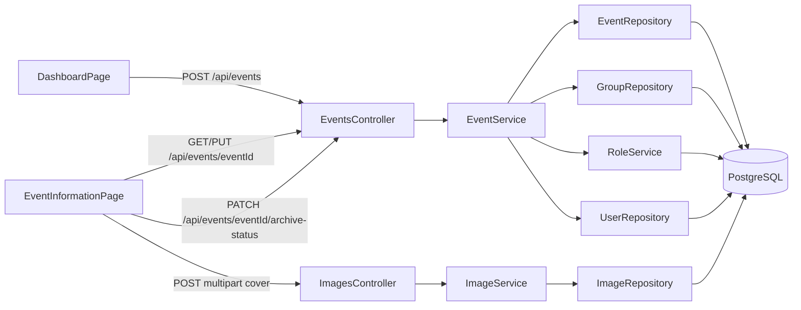
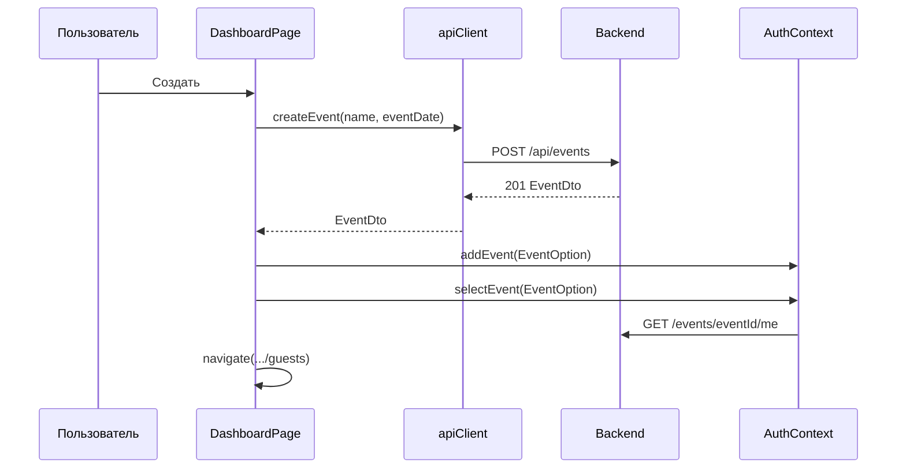
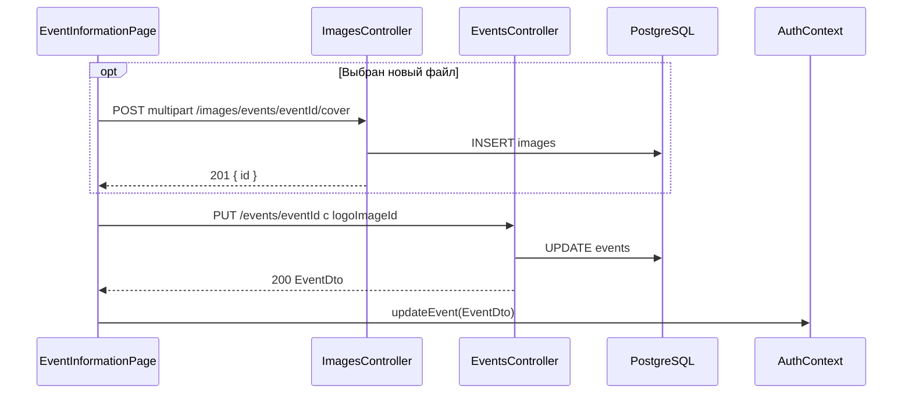
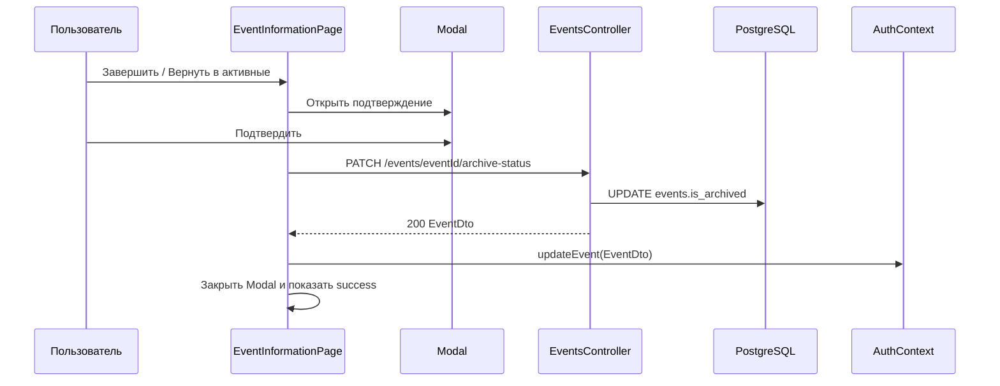
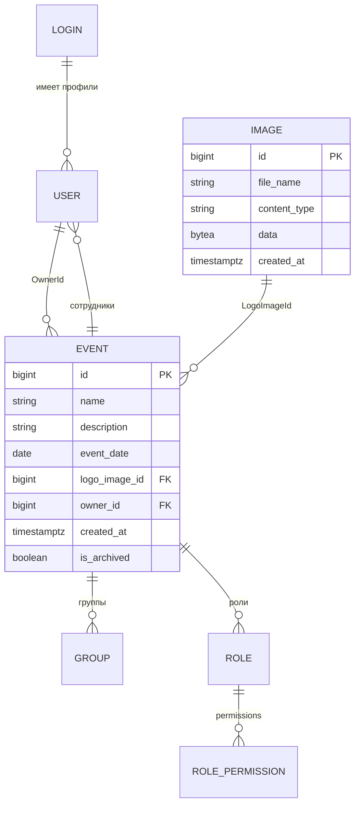

# Мероприятия: создание, настройки и архитектура

Документ описывает текущее поведение функциональности мероприятий: список на дашборде, создание мероприятия, вход в его контекст и редактирование на вкладке **«Настройки»**.

Документ состоит из двух частей:

1. правила и инструкция для пользователя системы;
2. техническое описание для разработчика с отдельными разделами по frontend и backend.

Термины:

- **Login** — глобальная учётная запись, используемая для входа;
- **User / сотрудник** — профиль Login внутри конкретного мероприятия;
- **Event / мероприятие** — основная сущность мероприятия;
- **владелец** — сотрудник, записанный в `Event.OwnerId`;
- **создатель** — пользователь, создавший мероприятие; при создании для него формируется новый профиль сотрудника, который становится владельцем;
- **обложка** — запись `ImageEntity`, идентификатор которой хранится в `Event.LogoImageId`.

---

# Часть 1. Для пользователя системы

## 1. Дашборд мероприятий

После входа пользователь попадает на `/dashboard`. На дашборде отображаются только мероприятия, в которых его Login связан хотя бы с одним профилем сотрудника.

Список разделяется на два блока:

1. **Активные мероприятия** — показываются первыми.
2. **Завершённые мероприятия** — показываются ниже активных.

Внутри каждого блока мероприятия сортируются по дате начала (`EventDate`) по возрастанию. На плитке дополнительно показывается статус: **«Активно»** или **«Завершено»**.

Плитка мероприятия показывает:

- обложку, если она загружена;
- стандартную иконку, если обложки нет;
- название;
- статус мероприятия;
- роль текущего пользователя именно в этом мероприятии;
- дату мероприятия;
- дату создания;
- ФИО создателя/владельца.

Роль не показывается в пользовательском меню на дашборде, потому что вне выбранного мероприятия у пользователя может быть несколько разных ролей. После входа в мероприятие роль снова отображается в пользовательском меню.

Нажатие на плитку:

1. загружает профиль текущего пользователя в выбранном мероприятии;
2. сохраняет выбранное мероприятие в контексте приложения и `localStorage`;
3. открывает `/events/{eventId}/guests`.

Если доступных мероприятий нет, выводится пустое состояние.

## 2. Кто может создавать и изменять мероприятия

Кнопка **«Создать мероприятие»** и вкладка **«Настройки»** доступны при наличии разрешения `create_event`.

| Роль | Доступ по умолчанию |
|---|---|
| `Administrator` | Да, стандартный администратор получает все permissions |
| `Manager` | Нет |
| `Creator` | Нет |
| Пользовательская роль | Да, если роли назначено `create_event` |

Для создания backend проверяет наличие `create_event` хотя бы в одном мероприятии пользователя, потому что у нового мероприятия ещё нет `eventId`.

Для открытия настроек, загрузки обложки, сохранения изменений, завершения мероприятия и возврата его в активные разрешение проверяется строго в редактируемом мероприятии. Право в другом мероприятии не даёт доступа.

Пока профиль пользователя не загружен, вкладка не отображается. Прямой переход на `/events/{eventId}/settings` также защищён проверкой permission.

Пользователь с обязательной сменой временного пароля сначала должен изменить пароль.

## 3. Создание мероприятия

Форма открывается модальным окном на дашборде и содержит:

| Поле | Обязательное | Поведение |
|---|---:|---|
| Название | Да | Пробелы по краям удаляются backend-ом |
| Дата мероприятия | Да | Выбирается через нативный календарь браузера |

Описание и обложка при создании через текущий интерфейс не задаются. Их можно добавить позже на вкладке **«Настройки»**.

Дата по умолчанию равна текущей локальной дате пользователя. Прошедшие и будущие даты разрешены: отдельного ограничения диапазона нет.

Во время запроса кнопки формы блокируются. После успешного создания модальное окно закрывается, новое мероприятие добавляется на дашборд, выбирается текущим и открывается вкладка гостей.

## 4. Что создаётся автоматически

Создание мероприятия — это не только запись с названием и датой. Backend автоматически создаёт рабочий контекст мероприятия и использует общий справочник ролей:

1. мероприятие;
2. единственную корневую группу `РМГ` с квотой `500`;
3. профиль создателя в новом мероприятии;
4. назначение этому профилю глобальной роли `Administrator`;
5. назначение профиля в корневую группу;
6. назначение созданного профиля владельцем мероприятия.

Стандартные роли хранятся один раз в таблице `roles` и переиспользуются всеми мероприятиями:

| Роль | Permissions |
|---|---|
| `Administrator` | Все существующие permissions |
| `Manager` | `create_guest`, `create_group`, `approve_guest` |
| `Creator` | `create_guest` |

При создании нового мероприятия backend не создаёт новые записи в `roles` и `role_permissions`. Новый профиль владельца получает `role_id` существующей глобальной роли `Administrator`.

Если любая операция завершается ошибкой, всё создание откатывается. Частично созданное мероприятие не должно оставаться в базе.

## 5. Владелец и создатель

Владелец хранится не как Login, а как сотрудник (`User`) внутри мероприятия.

При создании:

- backend находит один из существующих профилей создателя по его `LoginId`;
- копирует ФИО, email, телефон и meta в новый профиль;
- назначает новому профилю `Administrator` и корневую группу;
- записывает ID нового профиля в `Event.OwnerId`.

Поэтому ФИО создателя на плитке берётся из владельца мероприятия. Отдельного поля для смены владельца в интерфейсе сейчас нет.

## 6. Вкладка «Настройки»

Вкладка находится внутри выбранного мероприятия и использует общую адаптивную оболочку вкладок. Форма растягивается на всю ширину контентной области.

Доступные поля:

| Поле | Обязательное | Ограничение |
|---|---:|---|
| Название | Да | До 255 символов |
| Дата мероприятия | Да | Значение формата даты |
| Описание | Нет | До 2000 символов, показывается счётчик |
| Обложка | Нет | JPG, JPEG, PNG или SVG, до 5 МБ |

Отдельно вверху формы показывается статус мероприятия:

- **Активно** — доступна кнопка **«Завершить мероприятие»**;
- **Завершено** — доступна кнопка **«Вернуть в активные»**.

Перед сменой статуса frontend открывает модальное окно подтверждения. После подтверждения backend записывает новое значение `IsArchived`, а frontend обновляет локальный список мероприятий. На дашборде карточка сразу перемещается между блоками активных и завершённых. Завершённое мероприятие становится read-only: просмотр и поиск доступны, но создание и изменение гостей, сотрудников, групп, настроек и обложки блокируются до возврата в активные.

При загрузке страницы данные всегда запрашиваются с backend. Поэтому сохранённая обложка восстанавливается в превью после F5 через `LogoImageId`.

После успешного сохранения:

- показывается сообщение об успехе;
- название в шапке мероприятия обновляется без перезагрузки;
- данные плитки и выбранного мероприятия обновляются в локальном контексте;
- новая обложка появляется на плитке дашборда.

## 7. Выбор и загрузка обложки

При выборе файла frontend проверяет расширение и размер до отправки.

После выбора:

- показывается локальный предпросмотр;
- кнопка меняет оформление;
- появляется текст `✓ Изображение выбрано`;
- отображается имя файла.

При нажатии **«Сохранить»** новая обложка сначала загружается отдельным multipart-запросом. Backend возвращает числовой ID изображения, после чего этот ID отправляется в запросе обновления мероприятия.

Backend повторно проверяет:

- непустой файл;
- размер не более 5 МБ;
- допустимое расширение;
- соответствие MIME-типа расширению;
- сигнатуру JPEG или PNG;
- корректность и безопасность SVG.

Для SVG запрещены исполняемые и встраиваемые элементы, обработчики событий, `javascript:` и внешние ссылки в `href`/`src`.

Текущие ограничения жизненного цикла изображений:

- замена обложки не удаляет старую запись изображения;
- если изображение загрузилось, но последующее обновление мероприятия завершилось ошибкой, загруженная запись останется без связи;
- отдельной кнопки удаления обложки в интерфейсе нет.

## 8. Ошибки

Технические исключения backend не должны показываться пользователю. Контроллеры возвращают `400 Bad Request` с безопасным полем `message`.

Примеры ошибок:

- не указано название;
- не указана дата;
- название или описание превышает допустимую длину;
- выбранное изображение не существует;
- файл пустой, слишком большой или имеет недопустимый формат;
- SVG содержит небезопасные элементы;
- отсутствует permission `create_event` — в этом случае возвращается `403 Forbidden`.

---

# Часть 2. Для разработчика

## 1. Общая схема

Основные границы ответственности:

- frontend управляет формами, предварительной проверкой, состоянием и навигацией;
- API-контроллеры проверяют авторизацию, маппят контракты и скрывают технические ошибки;
- сервисы реализуют бизнес-правила;
- репозитории выполняют EF Core-запросы;
- PostgreSQL хранит мероприятия, изображения и связи.

## 2. Маршруты frontend

| Маршрут | Компонент | Защита |
|---|---|---|
| `/dashboard` | `DashboardPage` | Авторизованный пользователь |
| `/events/create` | Redirect на `/dashboard` | Отдельная страница создания больше не используется |
| `/events/{eventId}` | Redirect на `guests` | — |
| `/events/{eventId}/settings` | `EventSettingsPage` + `EventInformationPage` | `create_event` |

`ProtectedRoute` проверяет SID, необходимость смены пароля и требуемый permission. Если профиль ещё не загружен, защищённая permission-маршрутом страница не считается доступной.

## 3. Frontend: создание

Создание реализовано непосредственно в `DashboardPage`. На дашборде мероприятия разделяются на активные и завершённые: сначала выводится блок активных, ниже — завершённые. Внутри каждого блока карточки сортируются по `eventDate` по возрастанию.

Состояние формы:

- `isCreateModalOpen`;
- 
ame`;
- `eventDate`;
- `loading`;
- `error`.

`getTodayInputValue()` корректирует текущее время на timezone offset и формирует локальное значение `YYYY-MM-DD`, чтобы дата не сдвигалась при преобразовании через ISO.

Последовательность `handleCreateEvent`:

Frontend предполагает роль создателя `Administrator`, потому что это гарантируется бизнес-операцией backend.

## 4. Frontend: редактирование

`EventInformationPage` получает `eventId` из URL и при монтировании вызывает `apiClient.getEvent(eventId)`.

Локальное состояние:

- 
ame`, `description`, `eventDate`;
- `logoImageId` — сохранённая связь;
- `isArchived` — текущий статус мероприятия;
- `coverFile` — новый локально выбранный файл;
- `coverPreview` — URL сохранённого изображения или временный object URL;
- `archiveStatusTarget`, `archiveStatusSaving` — подтверждение и выполнение завершения/возврата в активные;
- `loading`, `saving`, `error`, `success`.

Для локального превью используется `URL.createObjectURL`. Cleanup эффекта вызывает `URL.revokeObjectURL`, чтобы не удерживать Blob в памяти.

Сохранение выполняется в два этапа:

Завершение и возврат в активные выполняются отдельным действием. Пользователь нажимает кнопку статуса в настройках, подтверждает операцию в `Modal`, после чего frontend вызывает `PATCH /events/{eventId}/archive-status` с `{ isArchived: true }` или `{ isArchived: false }`. Успешный ответ обновляет `AuthContext`, поэтому карточка сразу меняет раздел на дашборде.

`AuthContext.updateEvent` обновляет:

- элемент массива `events`;
- `currentEvent`, если редактируется выбранное мероприятие;
- ключи `events` и `currentEvent` в `localStorage`.

При восстановлении сессии `AuthContext` запрашивает `GET /events` и обновляет дату, дату создания, создателя, `logoImageId` и `isArchived` сохранённых `EventOption`.

## 5. Frontend: типы и API-клиент

Ключевые типы в `frontend/src/types/index.ts`:

| Тип | Назначение |
|---|---|
| `EventOption` | Компактные данные плитки, роль текущего пользователя и `isArchived` для группировки на дашборде |
| `EventDto` | Ответ списка, создания, обновления данных и смены статуса |
| `EventDetailDto` | Подробности мероприятия, `isArchived` и профиль текущего пользователя |
| `CreateEventRequest` | 
ame`, `eventDate`, опциональный `logoImageId` |
| `UpdateEventRequest` | 
ame`, `description`, `eventDate`, `logoImageId` |
| `UpdateEventArchiveStatusRequest` | `isArchived` для завершения или возврата мероприятия в активные |

Методы `apiClient`:

| Метод | HTTP |
|---|---|
| `getEvents()` | `GET /events` |
| `getEvent(eventId)` | `GET /events/{eventId}` |
| `getCurrentUserProfile(eventId)` | `GET /events/{eventId}/me` |
| `createEvent(request)` | `POST /events` |
| `updateEvent(eventId, request)` | `PUT /events/{eventId}` |
| `updateEventArchiveStatus(eventId, request)` | `PATCH /events/{eventId}/archive-status` |
| `uploadEventCover(eventId, file)` | `POST /images/events/{eventId}/cover` |
| `getImageUrl(imageId)` | Формирует `/api/images/{imageId}` |

Axios interceptor добавляет SID как `Authorization: Bearer {sid}`.

## 6. Frontend: файлы и ответственность

| Файл | Компонент / ответственность |
|---|---|
| `frontend/src/App.tsx` | Маршруты дашборда и настроек, permission-защита |
| `frontend/src/pages/DashboardPage.tsx` | Плитки, разделение активных и завершённых мероприятий, сортировка по дате начала, модальная форма создания, переход в мероприятие |
| `frontend/src/pages/EventSettingsPage.tsx` | Общая оболочка вкладок, видимость «Настроек», название в шапке |
| `frontend/src/pages/EventInformationPage.tsx` | Загрузка и редактирование данных, выбор и preview обложки, завершение и возврат мероприятия в активные через модальное подтверждение |
| `frontend/src/components/ProtectedRoute.tsx` | Проверка SID, временного пароля и permission |
| `frontend/src/components/Modal.tsx` | Унифицированная модалка создания и подтверждения смены статуса |
| `frontend/src/components/UserMenu.tsx` | Контекстное отображение роли внутри мероприятия |
| `frontend/src/contexts/AuthContext.tsx` | Список мероприятий, выбранное мероприятие, профиль и `localStorage` |
| `frontend/src/services/apiClient.ts` | Axios-вызовы Events и Images API |
| `frontend/src/types/index.ts` | DTO и request-типы TypeScript |
| `frontend/src/index.css` | Разделы дашборда, статусы плиток, полноширинная адаптивная форма, preview и состояния кнопок |

## 7. Backend API

Все пути имеют префикс `/api`.

| Метод и путь | Назначение | Защита | Ответ |
|---|---|---|---|
| `GET /events` | Мероприятия текущего Login | `[Authorize]` | `EventDto[]` |
| `GET /events/{eventId}` | Данные мероприятия и текущий профиль | `[Authorize]` + проверка участия | `EventDetailDto` |
| `GET /events/{eventId}/me` | Профиль и permissions | `[Authorize]` + проверка участия | `UserProfileDto` |
| `POST /events` | Создание мероприятия | `CanCreateEvent` в любом мероприятии | `201 EventDto` |
| `PUT /events/{eventId}` | Изменение данных | `CanCreateEvent` в указанном мероприятии | `200 EventDto` |
| `PATCH /events/{eventId}/archive-status` | Завершение мероприятия или возврат в активные | `CanCreateEvent` в указанном мероприятии | `200 EventDto` |
| `POST /images/events/{eventId}/cover` | Загрузка обложки | `CanCreateEvent` в указанном мероприятии | `201 { id }` |
| `GET /images/{id}` | Получение изображения | Публичный | Бинарный файл или `404` |

Публичный GET изображения нужен для обычного ``: браузер не добавляет SID из Axios interceptor к такому запросу.

## 8. Backend-контракты

`EventDto` содержит:

- `Id`;
- `Name`;
- `Description`;
- `EventDate`;
- `CreatedByName`;
- `LogoImageId`;
- `OwnerId`;
- `CreatedAt`;
- `IsArchived`.

`EventDetailDto` содержит те же данные мероприятия, включая `IsArchived`, и добавляет `CurrentUserProfile`.

`CreateEventRequest` не содержит описание. Хотя контракт допускает `LogoImageId`, текущая форма создания его не отправляет.

`UpdateEventRequest` содержит все редактируемые данные. `UpdateEventArchiveStatusRequest` содержит только `IsArchived`, чтобы смена статуса не была связана с сохранением названия, описания, даты или обложки. `ImageUploadResponse` содержит числовой `Id` созданного изображения.

## 9. Backend: транзакция создания

`EventService.CreateEventAsync` принимает `creatorLoginId`, название, дату и опциональный ID изображения.

Перед транзакцией сервис:

- проверяет непустое название;
- проверяет дату;
- загружает профили по `LoginId`;
- выбирает профиль с максимальным `CreatedAt` как источник контактных данных.

Операции выполняются через `Database.CreateExecutionStrategy().ExecuteAsync(...)`. Пользовательская транзакция создаётся внутри execution strategy, что совместимо с `NpgsqlRetryingExecutionStrategy`.

Внутри повторяемого блока:

1. очищается `ChangeTracker`;
2. начинается транзакция;
3. создаётся Event;
4. создаётся группа `РМГ/500`;
5. находится глобальная роль `Administrator`;
6. создаётся новый User создателя;
7. Event переключается на нового User как владельца;
8. транзакция фиксируется.

Первоначально `OwnerId` получает ID существующего профиля, потому что поле обязательно, а новый профиль ещё не создан. До commit владелец заменяется на профиль нового мероприятия.

При исключении транзакция откатывается. Контроллер логирует техническую причину, но возвращает frontend безопасное сообщение.

## 10. Backend: редактирование

`EventService.UpdateEventAsync` проверяет:

- название не пустое и не длиннее 255 символов;
- описание не длиннее 2000 символов;
- дата не равна `default(DateOnly)`;
- мероприятие существует;
- `LogoImageId`, если передан, существует в `images`.

Название и описание обрезаются по краям. Пустое описание сохраняется как 
ull`.

Владелец, дата создания и архивный статус через `PUT /events/{eventId}` не изменяются.

`EventService.UpdateEventArchiveStatusAsync` загружает мероприятие, проверяет его существование и записывает новое значение `IsArchived`. Endpoint `PATCH /events/{eventId}/archive-status` использует тот же permission `CanCreateEvent`, что и редактирование настроек мероприятия, и остаётся доступным для завершённых мероприятий, чтобы их можно было вернуть в активные.

`IEventService` также содержит `DeleteEventAsync`, но публичного DELETE endpoint и пользовательского интерфейса удаления мероприятия сейчас нет.

## 11. Backend: хранение и проверка изображений

`ImageEntity` хранит файл непосредственно в PostgreSQL:

| Поле | Назначение |
|---|---|
| `Id` | Числовой идентификатор |
| `FileName` | Очищенное через `Path.GetFileName` имя |
| `ContentType` | Нормализованный MIME-type |
| `Data` | `bytea` с содержимым файла |
| `AltText` | Текст по умолчанию «Обложка мероприятия» |
| `CreatedAt` | Дата загрузки |

`ImageService.SaveEventCover` нормализует формат по расширению. Для JPEG и PNG проверяются magic bytes. SVG разбирается как XML и проверяется обходом дерева.

`ImagesController.GetImage` использует числовой route constraint `{id:long}`, возвращает `Content-Disposition: inline` и поддерживает range processing.

## 12. Backend: permissions

Policy `CanCreateEvent` определяется в `WebApi/Program.cs` через `PermissionRequirement("create_event")`.

`PermissionAuthorizationHandler` работает в двух режимах:

- если в route есть `eventId`, вызывает `HasPermissionAsync(loginId, eventId, code)`;
- если `eventId` отсутствует и permission не требует группы, вызывает `HasPermissionInAnyEventAsync`.

`UserRepository.GetByLoginIdAsync` обязан загружать `Role.RolePermissions.Permission`. Без eager loading создание нового мероприятия после отдельного HTTP-запроса входа ошибочно получает `403`.

## 13. Модель данных

Связь `Event.OwnerId -> User.Id` имеет `Restrict`. Связь с изображением использует `SetNull` при удалении изображения.

## 14. Backend: файлы и ответственность

| Файл | Класс / ответственность |
|---|---|
| `Api/Controllers/EventsController.cs` | Получение, создание, обновление данных, смена `IsArchived`, DTO и безопасные ошибки |
| `Api/Controllers/ImagesController.cs` | Загрузка и выдача обложек |
| `Api/Contracts/EventContracts.cs` | Event DTO, requests, profile и ответ загрузки |
| `Api/Contracts/AuthContracts.cs` | `EventOption` в ответе входа |
| `Api/Controllers/AuthController.cs` | Возвращает доступные мероприятия и роль пользователя |
| `Application/Entities/Event.cs` | Доменная сущность мероприятия |
| `Application/Entities/ImageEntity.cs` | Доменная сущность изображения |
| `Application/Services/IEventService.cs` | Контракт операций Event, включая смену архивного статуса |
| `Application/Services/IImageService.cs` | Контракт чтения и сохранения изображений |
| `Application/Repositories/IEventRepository.cs` | Контракт хранения Event |
| `Application/Repositories/IImageRepository.cs` | Контракт хранения ImageEntity |
| `Infrastructure/Services/EventService.cs` | Транзакция создания, правила обновления и запись `IsArchived` |
| `Infrastructure/Services/ImageService.cs` | Валидация форматов, сигнатур и SVG |
| `Infrastructure/Services/RoleService.cs` | Стандартные роли и permissions |
| `Infrastructure/Services/PermissionService.cs` | Проверки `create_event` |
| `Infrastructure/Repositories/EventRepository.cs` | EF Core-запросы Event и owner |
| `Infrastructure/Repositories/ImageRepository.cs` | EF Core-запросы и сохранение байтов |
| `Infrastructure/Repositories/UserRepository.cs` | Профили создателя и eager loading permissions |
| `Infrastructure/Data/Configurations/EventConfiguration.cs` | Колонки, длины, FK Owner/Image |
| `Infrastructure/Data/Configurations/ImageEntityConfiguration.cs` | Таблица `images` и `bytea` |
| `Infrastructure/Data/ApplicationDbContext.cs` | DbSet и применение configurations |
| `Infrastructure/Authorization/PermissionAuthorizationHandler.cs` | Проверка permission по route |
| `Infrastructure/DependencyInjection.cs` | Регистрация сервисов и репозиториев |
| `WebApi/Program.cs` | Authentication, policies, middleware и `MigrateAsync` при старте |
| `Infrastructure/Migrations/20260901111221_InitialCreate.cs` | Единая актуальная схема и bootstrap-данные |

## 15. Начальная миграция и bootstrap

При старте `Program.cs` вызывает `Database.MigrateAsync()`.

Если базы данных ещё нет и PostgreSQL-пользователь имеет право `CREATE DATABASE`, Npgsql создаёт базу, после чего применяет единственную миграцию `20260901111221_InitialCreate`.

Миграция создаёт:

- всю актуальную схему;
- Login `admin` с паролем `admin` и `must_change_password = false`;
- bootstrap-мероприятие;
- владельца/сотрудника admin;
- корневую группу `РМГ/500`;
- пять permissions;
- стартовые роли и связи permissions;
- корректные значения sequences после явных seed-ID.

Роли в единой миграции сразу создаются как глобальный справочник: в `roles` нет `event_id`, а уникальность задана по `roles.name`.

Из-за циклической связи `Event.OwnerId -> User.Id` внешний ключ владельца добавляется после вставки bootstrap Event и User.

## 16. Важные ограничения и точки расширения

1. **Создание и загрузка обложки не объединены.** Форма создания не принимает файл; в настройках загрузка и update выполняются двумя HTTP-запросами.
2. **Нет очистки изображений.** Нужен отдельный механизм удаления неиспользуемых `ImageEntity`.
3. **Нет смены владельца.** Для неё потребуется отдельное бизнес-правило и endpoint.
4. **Нет удаления мероприятия в API.** Метод сервиса существует, но наружу не опубликован.
5. **Завершённое мероприятие блокирует изменяющие операции.** `EventStateGuard` запрещает создание и изменение гостей, сотрудников, групп, настроек и обложки. Исключение — `PATCH /events/{eventId}/archive-status`, через который мероприятие можно вернуть в активные.
6. **Дата не имеет диапазонной проверки.** При необходимости правило следует реализовать и на frontend, и на backend.
7. **Источник профиля создателя — самый новый User по LoginId.** Если контактные данные различаются между мероприятиями, копируется профиль с максимальным `CreatedAt`.
8. **Получение изображения публичное.** Если обложки должны быть закрытыми, потребуется другой механизм доставки авторизации для ``.

## 17. Проверка после изменений

Минимальный набор проверок:

1. 
pm.cmd run build` во `frontend`;
2. `dotnet build --no-restore` в `corebackend`;
3. применение миграции на пустой БД;
4. вход `admin/admin`;
5. создание мероприятия и проверка `РМГ/500`, трёх ролей и владельца;
6. изменение названия, описания и даты;
7. загрузка каждого допустимого типа изображения;
8. F5 на настройках и проверка сохранённого preview;
9. завершение мероприятия в настройках и проверка переноса плитки в блок завершённых;
10. проверка, что в завершённом мероприятии нельзя создавать/изменять гостей, сотрудников, группы и настройки;
11. возврат мероприятия в активные и проверка переноса плитки в блок активных;
11. проверка сортировки активных и завершённых мероприятий по дате начала;
12. проверка `403` для пользователя без `create_event`;
13. проверка безопасных `400` без stack trace.
