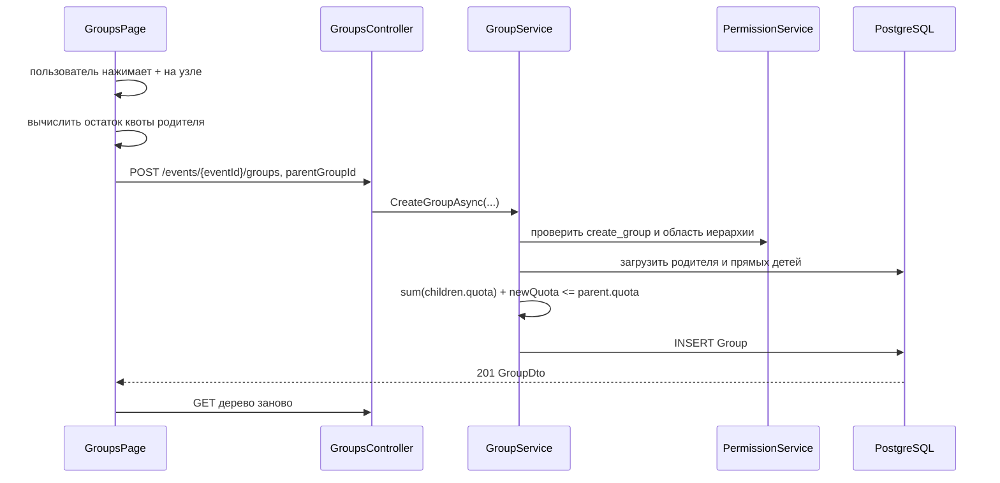

# Вкладка «Группы»: пользовательская логика и архитектура

Документ описывает текущее поведение групп в контексте мероприятия. Он состоит из двух частей:

1. инструкция и правила для пользователя системы;
2. техническое описание для разработчика с отдельными разделами по frontend и backend.

Термины:

- **корневая группа** — единственная верхнеуровневая группа мероприятия с `ParentGroupId == null`;
- **родительская группа** — группа, внутри которой создаётся дочерняя;
- **ветка** — выбранная группа и все её потомки любой глубины;
- **квота группы** — максимальный объём, который может быть распределён между её прямыми дочерними группами; квота также участвует в проверке возможности создания гостей;
- **прямые дочерние группы** — только группы следующего уровня, без рекурсивного суммирования всех потомков.

---

# Часть 1. Для пользователя системы

## 1. Когда доступна вкладка

Вкладка **«Группы»** предназначена для пользователей с разрешением `create_group` в выбранном мероприятии.

Для стандартных ролей доступ выглядит так:

| Роль | Доступ к группам |
|---|---|
| `Administrator` | Да, стандартный администратор получает все разрешения |
| `Manager` | Да, стандартному менеджеру назначается `create_group` |
| `Creator` | Нет по умолчанию |
| Пользовательская роль | Да, если роли назначено `create_group` |

Разрешение проверяется для текущего мероприятия. Наличие такого же разрешения в другом мероприятии не даёт доступ к группам выбранного мероприятия.

## 2. Как устроено дерево

Группы отображаются в виде горизонтального дерева:

- корневая группа расположена слева;
- дочерние группы находятся справа от родительской;
- уровни соединены линиями;
- дерево поддерживает произвольную глубину;
- в заголовке показывается общее количество групп во всём дереве;
- при нехватке ширины дерево прокручивается горизонтально.

Если мероприятие завершено, дерево групп работает в режиме просмотра: структура доступна, но создание, редактирование и удаление групп скрыты на frontend и запрещены на backend до возврата мероприятия в активные.

Карточка группы показывает:

- название;
- установленную квоту;
- иконку редактирования;
- кнопку `+` для создания дочерней группы;
- иконку удаления, если группа не является корневой.

### Навигация по большому дереву

Область дерева поддерживает несколько способов навигации:

- фон канвы представляет собой точечную сетку, которая помогает ориентироваться при перемещении большого дерева;
- колесо мыши внутри области дерева меняет масштаб схемы;
- круглые кнопки `+` и `−` справа внизу делают то же самое — увеличивают или уменьшают масштаб;
- при зажатой средней кнопке мыши, то есть колесе, дерево можно двигать внутри области просмотра;
- круглые кнопки со стрелками вверх/вниз справа внизу быстро прокручивают дерево к началу или концу;
- круглые кнопки с числами справа сверху сворачивают дерево до выбранного уровня вложенности.

Кнопки уровней строятся автоматически по максимальной глубине текущей схемы. Например:

- `1` — оставить видимым только первый уровень, то есть корневую группу;
- `2` — показать корень и его прямых потомков;
- максимальное число — развернуть дерево полностью.

Эти действия меняют только отображение дерева и не сохраняют изменения в базе.

## 3. Корневая группа

При создании мероприятия backend автоматически создаёт одну корневую группу:

- название — `РМГ`;
- квота — `500`;
- родитель отсутствует.

Поэтому отдельной общей кнопки **«Создать группу»** на странице нет. Любая новая группа создаётся только как дочерняя через `+` на существующей группе.

Корневую группу можно переименовать и изменить её квоту. Удалить её нельзя: иконка удаления отсутствует, а прямой запрос на удаление также отклоняется backend.

## 4. Создание дочерней группы

Чтобы создать группу:

1. нажмите `+` на нужной родительской группе;
2. в модальном окне проверьте название выбранной родительской группы и доступный остаток её квоты;
3. заполните обязательные поля **«Название»** и **«Квота»**;
4. нажмите **«Создать»**.

Родитель не выбирается отдельным полем: им всегда является узел, на котором был нажат `+`. В запрос отправляется ID этого узла.

### Правило квоты при создании

Для родительской группы должно выполняться условие:

```text
сумма квот существующих прямых дочерних групп + квота новой группы
    <= квота родительской группы
```

Пример: квота родителя равна `100`, а существующим дочерним группам выделено `30` и `40`. Для новой группы доступно не более `30`.

Модальное окно:

- рассчитывает доступный остаток;
- устанавливает его как максимальное значение поля;
- блокирует отправку при превышении;
- использует те же компактные и адаптивные стили, что и форма создания сотрудника.

Backend повторно рассчитывает квоту перед сохранением. Это защищает данные, если дерево устарело или несколько пользователей создают группы одновременно.

Нулевая квота технически допустима. Отрицательная квота запрещена.

## 5. Редактирование группы

Редактирование открывается по иконке карандаша. Модальное окно редактирования группы состоит из трёх вкладок:

- **«Группа»** — редактирование самой группы;
- **«Создать сотрудника»** — создание сотрудника сразу в текущей группе;
- **«Сотрудники»** — просмотр уже заведённых сотрудников текущей группы.

На вкладке **«Группа»** можно изменить:

- название;
- квоту.

Для новой квоты действуют два ограничения.

### Нижняя граница

Квота не может стать меньше суммы квот прямых дочерних групп:

```text
новая квота группы >= сумма квот её прямых дочерних групп
```

Например, если у группы есть дочерние квоты `20` и `30`, квоту самой группы нельзя уменьшить ниже `50`.

### Верхняя граница

Для некорневой группы изменение не должно привести к превышению квоты её родителя:

```text
сумма квот соседних групп + новая квота редактируемой группы
    <= квота родителя
```

В модальном окне показываются рассчитанные минимальное и, для некорневой группы, максимальное значения. Те же проверки повторяются на backend.

После успешного сохранения дерево загружается повторно.

### Создание сотрудника из группы

Вкладка **«Создать сотрудника»** доступна пользователю с правом `create_user`. Она повторяет основную форму создания сотрудника, но группа предопределена текущей редактируемой группой и не выбирается вручную.

Слева отображается панель **«Оригинальная структура»** с поиском по отделам, сотрудникам и должностям. Перед поиском находится чекбокс **«Отобразить сотрудников отдела»**. По умолчанию он включён.

Если чекбокс включён:

- frontend пытается сопоставить текущую группу с отделом оригинальной структуры по пути группы;
- в дереве показывается только найденный отдел, его сотрудники и дочерние отделы;
- остальные ветки оригинальной структуры скрываются;
- поиск работает только внутри уменьшенного дерева.

Если соответствующий отдел не найден, пользователь видит подсказку снять галочку и искать по всей оригинальной структуре.

Если чекбокс выключен, панель показывает всю оригинальную структуру без ограничения текущим отделом.

При выборе сотрудника из оригинальной структуры в форму переносятся ФИО, а связь с исходной записью сохраняется в создаваемом `User` через `organizationEmployeeId`. Благодаря этому на вкладке **«Сотрудники»** можно показывать должность и отдел.

### Сотрудники группы

Вкладка **«Сотрудники»** показывает список сотрудников, которые сейчас привязаны к редактируемой группе.

Пока список доступен только для просмотра. В строке отображаются:

- ФИО;
- должность из оригинальной структуры, если сотрудник был создан с привязкой к исходной записи;
- отдел из оригинальной структуры, если связь есть.

## 6. Удаление группы и ветки

Удаление доступно по иконке корзины у всех групп, кроме корневой.

Перед запросом открывается модальное окно приложения с кнопками **«Нет»** и **«Да, удалить»**. Браузерное окно `confirm` не используется. Во время выполнения запроса модалку нельзя закрыть.

Если удаляемая группа является родительской, вместе с ней удаляются все дочерние группы на всех уровнях. Удаление необратимо.

Ветка не может быть удалена, если хотя бы в одной входящей в неё группе есть:

- сотрудник;
- гость.

Система не удаляет и не переносит связанных людей автоматически. Сначала их нужно удалить или вручную переназначить в группы вне удаляемой ветки.

Корневая группа защищена отдельно и не удаляется даже прямым API-запросом.

## 7. Область управления

Одного разрешения `create_group` недостаточно для произвольной работы со всем мероприятием. Backend разрешает создавать, редактировать и удалять группы только в области группы текущего пользователя:

- в собственной группе пользователя;
- в любой её дочерней группе любой глубины.

Группа из другой ветки недоступна для изменения. Для администратора, назначенного в корневую группу, областью управления является всё дерево.

Frontend сейчас показывает действия на всех загруженных узлах, а окончательное ограничение области выполняет backend. При попытке изменить недоступную группу запрос будет отклонён.

## 8. Ошибки и адаптивность

Пользователь получает отдельные состояния для:

- загрузки дерева;
- отсутствия групп;
- ошибки загрузки;
- ошибки создания;
- ошибки редактирования;
- ошибки удаления.

Формы создания и редактирования:

- на широком экране используют две колонки;
- на экранах до `640 px` переходят в одну колонку;
- используют общие стили модалок сотрудников;
- блокируют поля и кнопки во время сохранения.

На мобильном устройстве карточки остаются расположенными слева направо, а контейнер дерева получает горизонтальную прокрутку.

---

# Часть 2. Для разработчика

## 1. Общая модель и инварианты

```text
Event
  └── Group (root, parent_group_id = null)
        ├── Group
        │     ├── Group
        │     └── Group
        └── Group

Group
  ├── event_id
  ├── parent_group_id -> Group.id
  ├── name
  ├── quota
  ├── Users[]
  └── Guests[]
```

Основные инварианты:

1. при штатном создании Event создаётся одна корневая Group;
2. корень имеет `ParentGroupId == null` и не удаляется через Groups API;
3. квота неотрицательна;
4. сумма квот прямых детей не превышает квоту родителя;
5. при уменьшении квота группы не может стать меньше суммы квот её прямых детей;
6. имена групп уникальны в пределах мероприятия благодаря индексу `(event_id, name)`;
7. управление ограничено собственной группой пользователя и её потомками;
8. ветка с User или Guest не удаляется.

## 2. Основные потоки

### Создание



### Редактирование

```text
PUT группы
  -> проверить Event и область управления
  -> проверить quota >= 0
  -> проверить quota >= sum(прямых детей)
  -> если есть родитель:
       sum(соседей) + quota <= parent.quota
  -> обновить name и quota
  -> SaveChanges
```

### Удаление

```text
DELETE группы
  -> проверить Event и область управления
  -> запретить ParentGroupId == null
  -> breadth-first получить всех потомков
  -> проверить отсутствие User и Guest во всей ветке
  -> пометить группы на удаление от листьев к выбранному узлу
  -> SaveChanges
```

Удаление выполняется от наиболее глубоких потомков к родителю из-за `DeleteBehavior.Restrict` на самоссылочной связи Group.

## 3. Frontend

### 3.1. Файлы и ответственность

| Файл | Компонент / тип | Ответственность |
|---|---|---|
| `frontend/src/pages/GroupsPage.tsx` | `GroupsPage`, `GroupNode` | Загрузка и рекурсивный рендер дерева, расчёты квот, модалки создания/редактирования/удаления, вызовы API |
| `frontend/src/pages/EventSettingsPage.tsx` | `EventSettingsPage` | Видимость вкладки в desktop/mobile-навигации |
| `frontend/src/components/ProtectedRoute.tsx` | `ProtectedRoute` | Проверка SID, временного пароля и `create_group` для прямого маршрута |
| `frontend/src/components/Modal.tsx` | `Modal` | Общая модалка, Escape, backdrop, блокировка прокрутки страницы |
| `frontend/src/contexts/AuthContext.tsx` | `AuthProvider`, `useAuth` | Текущий Event, профиль и permissions, восстановление после F5 |
| `frontend/src/services/apiClient.ts` | `ApiClient` | `getGroupTree`, `createGroup`, `updateGroup`, `deleteGroup` |
| `frontend/src/types/index.ts` | `GroupDto`, `GroupTreeDto`, request DTO | TypeScript-контракты групп |
| `frontend/src/utils/groups.ts` | `flattenGroups`, `groupNameById` | Использование дерева групп в формах сотрудников и гостей |
| `frontend/src/App.tsx` | маршруты | Защищённый маршрут `/events/:eventId/groups` |
| `frontend/src/index.css` | CSS | Горизонтальное дерево, соединительные линии, действия узла, общие стили модалок и mobile media query |

### 3.2. Состояние `GroupsPage`

Основные группы состояния:

- данные: `groups`, `loading`, `error`;
- общий статус мутации: `saving`;
- создание: `parentGroup`, `form`;
- редактирование: `editingGroup`, `editForm`;
- удаление: `deleteGroup`.

Открытая модалка определяется наличием соответствующего объекта Group, отдельные boolean-флаги не используются.

### 3.3. Рекурсивный рендер

`GroupNode` получает:

- текущую группу;
- родителя текущей группы;
- признак `isRoot`;
- callbacks создания, редактирования и удаления.

Родитель нужен frontend для вычисления верхней границы при редактировании. `isRoot` передаётся только элементам верхнего массива и скрывает кнопку удаления.

`countGroups` рекурсивно считает все узлы. CSS строит дерево через flex/grid, псевдоэлементы соединительных линий и вложенные `.group-tree-children`.

### 3.4. Расчёты квот

При создании:

```ts
available = parent.quota - sum(parent.children[].quota)
```

При редактировании:

```ts
minimum = sum(group.children[].quota)
maximum = parent.quota - sum(parent.children кроме group)
```

У корня `maximum` отсутствует. Ограничения передаются в HTML-поля как `min` и `max` и дополнительно участвуют в `disabled` кнопки отправки.

Frontend-проверка нужна для интерфейса, но не считается доверенной: сервер повторяет все проверки.

### 3.5. Права и восстановление профиля

- маршрут обёрнут в `ProtectedRoute requiredPermission="create_group"`;
- `GroupsPage` использует `currentUser?.permissions.includes("create_group") ?? false`;
- `AuthProvider` во время первоначального восстановления показывает общий экран загрузки и повторно получает `/me` после F5;
- после загрузки дерева все мутации завершаются повторным `GET`.

Текущая особенность: в `EventSettingsPage` видимость ссылки вычисляется через `currentUser?.permissions.includes("create_group") ?? true`, а в `ProtectedRoute` отказ выполняется только если `currentUser` уже существует. Обычно это перекрывается общим `loading` в `AuthProvider`, но безопасным значением по умолчанию для обоих мест должен быть `false`.

## 4. Backend

### 4.1. API и контракты

| Файл | Класс / контракт | Ответственность |
|---|---|---|
| `corebackend/src/Api/Controllers/GroupsController.cs` | `GroupsController` | GET дерева, POST, PUT, DELETE, маппинг DTO |
| `corebackend/src/Api/Contracts/GroupContracts.cs` | group DTO | `GroupDto`, `GroupTreeDto`, `CreateGroupRequest`, `UpdateGroupRequest` |
| `corebackend/src/WebApi/Program.cs` | policy setup | Регистрация `CanCreateGroup` |

Все пути имеют префикс `/api`.

| Метод и путь | Назначение | Защита | Ответ |
|---|---|---|---|
| `GET /events/{eventId}/groups` | Получить дерево произвольной глубины | `[Authorize]` | `GroupTreeDto[]` |
| `POST /events/{eventId}/groups` | Создать дочернюю группу | `CanCreateGroup` | `201 GroupDto` |
| `PUT /events/{eventId}/groups/{groupId}` | Изменить название и квоту | `CanCreateGroup` | `204` |
| `DELETE /events/{eventId}/groups/{groupId}` | Удалить некорневую ветку | `CanCreateGroup` | `204` |

`CreateGroupRequest` содержит 
ame`, `quota`, `parentGroupId`. UI всегда передаёт `parentGroupId`; если другой клиент передаст 
ull`, сервис использует группу текущего пользователя.

`UpdateGroupRequest` содержит только 
ame` и `quota`. Перемещение группы к другому родителю через API не поддерживается.

### 4.2. Application

| Файл | Тип | Ответственность |
|---|---|---|
| `corebackend/src/Application/Entities/Group.cs` | `Group` | Иерархическая сущность, квота и navigation properties |
| `corebackend/src/Application/Services/IGroupService.cs` | `IGroupService` | Контракт чтения и мутаций групп |
| `corebackend/src/Application/Services/IPermissionService.cs` | `IPermissionService` | Контракт permission и проверок иерархии |
| `corebackend/src/Application/Repositories/IGroupRepository.cs` | `IGroupRepository` | Получение групп, детей и всех потомков, CRUD |
| `corebackend/src/Application/Repositories/IUserRepository.cs` | `IUserRepository` | Проверка сотрудников в удаляемой ветке |
| `corebackend/src/Application/Repositories/IGuestRepository.cs` | `IGuestRepository` | Проверка гостей в удаляемой ветке |

### 4.3. Infrastructure

| Файл | Класс | Ответственность |
|---|---|---|
| `Infrastructure/Services/GroupService.cs` | `GroupService` | Права, создание, формулы квот, изменение, рекурсивное удаление |
| `Infrastructure/Services/PermissionService.cs` | `PermissionService` | `create_group`, группа пользователя, проверка собственной группы и потомков |
| `Infrastructure/Services/EventService.cs` | `EventService` | Автоматическое создание корневой группы |
| `Infrastructure/Services/GuestService.cs` | `GuestService` | Использование квоты группы при создании гостей |
| `Infrastructure/Services/RoleService.cs` | `RoleService` | Отдаёт глобальный справочник ролей с permissions |
| `Infrastructure/Repositories/GroupRepository.cs` | `GroupRepository` | EF Core-запросы дерева, детей и обход потомков в ширину |
| `Infrastructure/Repositories/UserRepository.cs` | `UserRepository` | `GetByGroupIdAsync` для защиты удаления |
| `Infrastructure/Repositories/GuestRepository.cs` | `GuestRepository` | `GetByGroupIdAsync` для защиты удаления |
| `Infrastructure/Data/Configurations/GroupConfiguration.cs` | `GroupConfiguration` | Таблица, индекс, self-FK и ограничения удаления |
| `Infrastructure/Data/ApplicationDbContext.cs` | `ApplicationDbContext` | `DbSet<Group>` и применение конфигураций |
| `Infrastructure/Authorization/PermissionRequirement.cs` | requirement | Описание разрешения policy |
| `Infrastructure/Authorization/PermissionAuthorizationHandler.cs` | handler | Извлекает `eventId` и проверяет permission |
| `Infrastructure/DependencyInjection.cs` | `AddInfrastructure` | Регистрация GroupService и репозиториев |
| `Infrastructure/Migrations/20260901111221_InitialCreate.cs` | единая начальная миграция | Создаёт таблицу `groups`, индексы, FK и корневую bootstrap-группу `РМГ` с квотой 500 |

### 4.4. Загрузка дерева

`GroupService.GetGroupHierarchyAsync` загружает все группы мероприятия через `GetByEventIdAsync`, после чего оставляет элементы с `ParentGroupId == null`. Поскольку все сущности отслеживаются одним EF Core context, relationship fixup наполняет `ChildGroups` на каждом уровне. `GroupsController.MapToTreeDtos` затем рекурсивно строит DTO.

Получение только `GetRootGroupsByEventAsync` с одним `Include(ChildGroups)` показало бы только один дочерний уровень, поэтому для текущего дерева используется загрузка полного набора мероприятия.

### 4.5. Проверка permissions и области

Policy `CanCreateGroup` зарегистрирована как:

```text
PermissionRequirement("create_group", requiresGroup: true)
```

Для POST policy проверяет наличие permission, а `CreateGroupAsync` дополнительно вызывает `CanCreateGroupInParentAsync`.

Для PUT и DELETE после policy сервис повторно:

1. проверяет `create_group`;
2. получает группу пользователя в Event;
3. разрешает целевую группу, если она является собственной группой пользователя или её потомком;
4. проверяет принадлежность целевой группы `eventId` из маршрута.

Это не позволяет подставить ID группы другого мероприятия или соседней ветки.

### 4.6. Схема данных и ограничения БД

Таблица `corebackend.groups` содержит:

- `id`;
- `event_id`;
- nullable `parent_group_id`;
- `name` длиной до 255 символов;
- `quota`;
- `created_at`.

Ограничения:

- уникальный индекс `(event_id, name)`;
- Event → Groups: `Cascade`;
- Parent Group → ChildGroups: `Restrict`;
- Group → Users: `Restrict`;
- Group → Guests: `Restrict`.

Из-за `Restrict` сервис явно проверяет связанные User/Guest и удаляет дочерние группы раньше родителей. Удаление всего Event остаётся каскадным относительно групп.

## 5. Квоты и взаимодействие с гостями

`GroupService` проверяет распределение квоты только между прямыми дочерними группами.

`GuestService` при создании гостя использует другую формулу:

```text
availableForGuest = group.quota
                  - sum(directChildren.quota)
                  - count(nonRejectedGuestsInGroup)
```

Гости в дочерних группах не вычитаются напрямую из квоты родителя: их вместимость уже зарезервирована квотой дочерней группы.

Важная текущая граница: создание/редактирование дочерней группы в `GroupService` не вычитает уже созданных гостей самого родителя. Поэтому совокупность `children quota + guests directly in parent` может превысить квоту после последующего перераспределения групп. Если требуется единый строгий инвариант, проверки GroupService должны учитывать гостей родительской группы так же, как GuestService.

## 6. Текущие особенности и ограничения

1. **`UsedQuota` и `AvailableQuota` в Groups API пока не рассчитаны.** `GroupsController` возвращает `UsedQuota = 0`, а `AvailableQuota = group.Quota`. Текущий `GroupsPage` не доверяет этим полям и вычисляет остаток из `quota` и `children`.
2. **GET защищён слабее мутаций.** `GET /groups` требует только аутентификацию, хотя вкладка и маршрут frontend требуют `create_group`.
3. **Навигация временно использует небезопасный default.** В `EventSettingsPage` для `canOpenGroups` сейчас указано `?? true`; рекомендуется заменить на `?? false`.
4. **Frontend показывает действия на всём дереве.** Область собственной ветки вычисляет только backend, поэтому пользователь может увидеть действие, которое завершится `403`.
5. **Ровно один корень обеспечивается штатным сценарием, а не ограничением БД.** `EventService` создаёт один корень, но схема допускает ручное создание нескольких записей с `parent_group_id = null`.
6. **Название уникально во всём Event, а не только среди соседей.** Две группы в разных ветках не могут иметь одинаковое имя.
7. **Нет endpoint перемещения группы.** `parent_group_id` после создания не редактируется.
8. **Проверка и сохранение квот не заключены в отдельную транзакцию с блокировкой.** При конкурентных запросах теоретически возможна гонка между чтением суммы и вставкой/обновлением.
9. **Удаление ветки выполняет отдельные запросы для сотрудников и гостей каждой группы.** Для очень больших деревьев это N+1-сценарий; при необходимости следует добавить агрегированную проверку в репозитории.
10. **Числовой идентификатор из SID — LoginId.** Проверки policy и области управления ищут профиль строго по паре `(LoginId, EventId)`, а получение permissions уже найденного профиля использует `User.Id`.
11. **Ошибки уникального индекса не преобразуются GroupService в доменное сообщение.** Конфликт имени может вернуться как необработанная ошибка БД, а frontend покажет общее сообщение.

## 7. Проверка и запуск после изменений

Frontend:

```powershell
cd C:\git\rmgevents\frontend
npm.cmd run build
```

Backend:

```powershell
cd C:\git\rmgevents\corebackend
dotnet build --no-restore
```

После любых изменений backend контейнер пересобирается и перезапускается:

```powershell
cd C:\git\rmgevents
docker compose -f deploy\docker-compose.local.yml up -d --build corebackend
docker compose -f deploy\docker-compose.local.yml ps corebackend
docker compose -f deploy\docker-compose.local.yml logs --tail 50 corebackend
```

Backend доступен по `http://localhost:5000`, frontend в локальной compose-конфигурации — по `http://localhost:5173`.

---

# Дополнение. Текущая функциональность групп

Этот раздел фиксирует актуальные изменения вкладки **«Группы»**: поиск по дереву, сворачивание веток, сброс групп и работу с оригинальной организационной структурой.

## Часть 1. Для пользователя системы

### 1. Поиск группы по названию

Над деревом групп находится поле **«Поиск группы»**.

Как пользоваться:

1. введите название группы или его часть;
2. нажмите `Enter`;
3. если совпадение найдено, страница плавно прокрутится к нужному блоку;
4. найденная группа будет визуально подсвечена.

Поиск запускается только по нажатию `Enter`. Обычный ввод текста не отправляет запросы и не меняет положение дерева.

Логика поиска:

- сначала ищется точное совпадение названия;
- если точного совпадения нет, используется первое частичное совпадение;
- поиск выполняется по уже загруженному дереву на frontend;
- backend-запрос для поиска не выполняется.

Если найденная группа находится внутри свернутой ветки, система сначала раскрывает всех её родителей, а затем прокручивает дерево к найденному блоку.

### 2. Сворачивание и разворачивание дерева

У группы, у которой есть дочерние группы, отображается круглая кнопка сворачивания/разворачивания.

Поведение:

- кнопка доступна начиная с корневой группы;
- при сворачивании дочерняя ветка скрывается;
- при разворачивании дочерняя ветка снова отображается;
- состояние сворачивания хранится только на frontend и не сохраняется в БД;
- обновление страницы снова загружает дерево в исходном раскрытом виде.

Это сделано как навигационная возможность: она не меняет сами группы, их связи, квоты или права.

### 3. Компактное отображение блоков групп

Карточки групп сделаны компактными:

- уменьшены ширина, высота и внутренние отступы;
- название группы отображается обычным начертанием, без жирности;
- шрифт названия и квоты уменьшен;
- кнопки действий и кнопка сворачивания уменьшены;
- длинные названия не обрезаются троеточием, а переносятся внутри карточки.

### 4. Интерактивный перенос групп

Группу можно переносить мышью внутри дерева.

Поведение интерфейса:

- корневая группа не перетаскивается;
- при зажатии группы подсвечивается вся ветка: выбранная группа и все её потомки;
- если ветка была свернута, она раскрывается, чтобы пользователь видел переносимую структуру;
- при наведении переносимой группы на допустимую целевую группу цель подсвечивается зелёным;
- при наведении на запрещённую цель отображается красная подсветка;
- красная подсветка групп с нулевой квотой не мешает зелёной подсветке цели переноса;
- после успешного переноса дерево групп перезагружается.

Правила переноса не отличаются от правил формы редактирования:

- группу нельзя перенести в саму себя;
- группу нельзя перенести в своего потомка;
- перенос в текущего родителя не выполняется;
- при переносе квота переносимой группы и всех её потомков сбрасывается в `0`;
- backend остаётся главным валидатором операции.

### 5. Шаблоны структуры групп

В верхней части вкладки рядом с поиском находятся кнопки:

- **«Сохранить в шаблон»**;
- **«Подгрузить из шаблона»**.

Сохранение в шаблон доступно всегда пользователю с правом `create_event`, если мероприятие активно. В шаблон копируется текущее дерево групп: названия, иерархия и квоты. Шаблон хранится отдельно от мероприятия и не ссылается на реальные группы.

При подгрузке из шаблона пользователь выбирает один из доступных шаблонов. При применении:

- корневая группа текущего мероприятия сохраняется;
- корневая группа шаблона не создаётся как отдельная группа;
- дочерние группы корня шаблона создаются внутри существующей корневой группы мероприятия;
- старая структура мероприятия заменяется, кроме корня;
- если в мероприятии есть сотрудники или гости, применить шаблон можно только когда текущая структура состоит из одной корневой группы;
- если структура уже содержит дочерние группы и в мероприятии есть сотрудники/гости, backend отклоняет применение шаблона.

Для пользователя это означает: шаблон можно снять с любой готовой структуры, а применять безопаснее всего к новому или предварительно сброшенному мероприятию.

### 6. Загрузка оригинальной структуры

Под деревом групп находится малозаметная служебная кнопка **«Загрузить оригинальную структуру»**.

Она предназначена для загрузки исходного Excel-файла с организационной структурой. Файл не смешивается напрямую с рабочими группами мероприятия. Данные сначала сохраняются в отдельные таблицы:

- `organization_departments`;
- `organization_employees`.

Пользовательский сценарий:

1. нажать **«Загрузить оригинальную структуру»**;
2. выбрать `.xlsx`-файл;
3. дождаться результата загрузки;
4. посмотреть сообщение с количеством загруженных отделов, сотрудников и предупреждений.

При повторной загрузке старая оригинальная структура заменяется новой. Рабочие группы мероприятия при этом не меняются.

Endpoint защищён правом `CanCreateEvent`, то есть доступен тем пользователям, которые могут создавать мероприятие.

### 7. Применение оригинальной структуры к группам

Кнопка **«Применить оригинальную структуру»** создаёт группы мероприятия на основе ранее загруженных отделов.

Правила:

- существующие группы мероприятия не удаляются;
- корневая группа остаётся той же;
- отделы из оригинальной структуры создаются как дочерние группы под корнем и далее по иерархии;
- если подходящая группа уже есть у нужного родителя, она переиспользуется;
- если имя уже занято в другом месте мероприятия, система создаёт уникальное имя с уточнением родителя;
- после применения дерево групп перезагружается.

Квоты распределяются пропорционально от базового значения `10000`:

- корневая группа получает квоту не меньше `10000`;
- если у группы 5 дочерних отделов, каждый получает `2000`;
- если у дочернего отдела 2 своих ребёнка, каждый из них получает `1000`;
- если существующая группа уже имеет большую квоту, она не уменьшается;
- родительские квоты могут быть увеличены, если это нужно для сохранения инвариантов дерева.

Endpoint также защищён правом `CanCreateEvent`.

### 8. Сброс групп

Кнопка **«Сбросить группы»** удаляет структуру групп мероприятия и оставляет только корневую группу.

Перед выполнением открывается модальное окно подтверждения.

Что происходит при сбросе:

- все гости мероприятия переносятся в корневую группу;
- все сотрудники мероприятия переносятся в корневую группу;
- все группы кроме корневой удаляются;
- квота корневой группы сбрасывается к дефолтному значению `10000`;
- после операции дерево групп перезагружается;
- в лог мероприятия добавляется запись о сбросе.

Сброс защищён правом `CanCreateEvent`. Это потенциально разрушительная операция для дерева групп, поэтому она не привязана к обычному `create_group`.

## Часть 2. Для разработчика

### 1. Frontend: поиск и сворачивание

Основной файл:

- `frontend/src/pages/GroupsPage.tsx`.

Для поиска используются helper-функции:

- `normalizeGroupSearch`;
- `flattenGroups`;
- `findGroupByName`;
- `findGroupPathById`.

Поиск работает по массиву `GroupTreeDto[]`, который уже загружен через `getGroupTree`.

Состояние поиска:

- `groupSearch`;
- `groupSearchMessage`;
- `highlightedGroupId`.

По нажатию `Enter` вызывается `runGroupSearch()`.

При успешном поиске:

1. сохраняется `highlightedGroupId`;
2. через `findGroupPathById` находится путь от корня до найденной группы;
3. все ancestor-группы удаляются из `collapsedGroupIds`;
4. после обновления DOM выполняется `scrollIntoView`.

Состояние сворачивания:

- `collapsedGroupIds: Set<number>`.
- `groupTreeZoom` — текущий масштаб дерева;
- `isGroupTreePanning` — режим перемещения области дерева средней кнопкой мыши;
- `groupsTreePanRef` — стартовая позиция курсора и scroll-позиция контейнера для pan-навигации.

`GroupNode` получает:

- `collapsedGroupIds`;
- `onToggleCollapse`;
- `highlightedGroupId`.

Дочерний список рендерится только если:

```tsx
hasChildren && !isCollapsed
```

Дополнительные helper-функции для управления видом дерева:

- `getMaxGroupDepth(groups)` — определяет максимальную вложенность дерева;
- `getCollapsedGroupIdsForVisibleDepth(groups, visibleDepth)` — вычисляет набор групп, которые нужно свернуть, чтобы показать дерево до выбранного уровня;
- `collapseGroupsToDepth(depth)` — применяет сворачивание по кнопке уровня;
- `clampGroupTreeZoom(value)` — ограничивает масштаб дерева допустимым диапазоном;
- `updateGroupTreeZoom(nextZoomValue, anchor)` — меняет масштаб и сохраняет точку под курсором;
- `zoomGroupTree(direction, anchor)` — шаг масштабирования от колеса мыши;
- `zoomGroupTreeFromCenter(direction)` — шаг масштабирования от кнопок `+` / `−`;
- `handleGroupTreeWheel(event)` — перехватывает колесо мыши внутри `.groups-tree-scroll` и масштабирует дерево;
- `handleGroupTreePanStart(event)` — запускает перемещение при `event.button === 1`.

Для pan-навигации используются `scrollLeft` и `scrollTop` контейнера `.groups-tree-scroll`. Это не меняет координаты узлов и не конфликтует с drag & drop групп, потому что перенос групп выполняется левой кнопкой мыши, а pan — средней.

Масштаб применяется к внутреннему списку `.groups-tree` через CSS-переменную:

```tsx
<ul
  className="groups-tree"
  style={{ "--groups-tree-zoom": groupTreeZoom } as React.CSSProperties}
>
```

В CSS используется:

```css
.groups-tree {
  zoom: var(--groups-tree-zoom, 1);
}
```

Кнопки уровней создаются из текущей глубины дерева:

```ts
const maxGroupDepth = useMemo(() => Math.max(1, getMaxGroupDepth(groups)), [groups]);
const groupDepthLevels = useMemo(
  () => Array.from({ length: maxGroupDepth }, (_, index) => index + 1),
  [maxGroupDepth]
);
```

Нажатие на максимальный уровень разворачивает всё дерево, промежуточные значения сворачивают узлы на выбранной глубине и ниже.

Стили находятся в:

- `frontend/src/index.css`.

Ключевые классы:

- `.groups-search-row`;
- `.groups-search-field`;
- `.groups-search-message`;
- `.group-tree-node-highlighted`;
- `.group-tree-collapse-toggle`;
- `.group-tree-node`.
- `.groups-tree-toolbar`;
- `.groups-tree-depth-actions`;
- `.groups-tree-depth-button`;
- `.groups-tree-zoom-actions`;
- `.groups-tree-scroll-actions`;
- `.groups-tree-scroll-panning`.

### 1.1. Frontend: модалка редактирования группы

Модалка редактирования группы реализована в `frontend/src/pages/GroupsPage.tsx` и использует три вкладки:

- `settings` — редактирование названия, квоты и переноса группы;
- `create-user` — создание сотрудника в текущей группе;
- `users` — просмотр сотрудников текущей группы.

Активная вкладка хранится в состоянии:

```ts
const [activeEditTab, setActiveEditTab] = useState<GroupEditTab>("settings");
```

Для вкладки создания сотрудника используются те же справочники, что и на странице сотрудников:

- `roles`;
- `organizationTree`;
- `similarUsers`.

Группа не выбирается пользователем. В `CreateUserRequest` всегда отправляется `groupId` редактируемой группы:

```ts
groupId: editingGroup.group.id
```

Если сотрудник выбран из оригинальной структуры, frontend также отправляет:

```ts
organizationEmployeeId: selectedOrganizationEmployeeId ?? undefined
```

Фильтр **«Отобразить сотрудников отдела»** управляется состоянием:

```ts
const [showOnlyCurrentDepartmentEmployees, setShowOnlyCurrentDepartmentEmployees] = useState(true);
```

Сопоставление текущей группы с отделом оригинальной структуры выполняется на frontend:

1. из `GroupSearchOption.path` берётся путь группы;
2. корневая группа отбрасывается;
3. путь сравнивается с путями отделов из `OrganizationStructureTreeDto`;
4. если точного совпадения нет, используется fallback по названию последнего узла.

Ключевые helper-функции:

- `buildOrganizationDepartmentPathOptions`;
- `getGroupDepartmentPath`;
- `findMatchingOrganizationDepartment`;
- `departmentMatchesSearch`.

Если отдел найден, в `OrganizationDepartmentNode` передаётся массив только из этого отдела. Компонент уже рекурсивно показывает сотрудников отдела и всех дочерних отделов. Если чекбокс выключен, в дерево передаются все `organizationTree.departments`.

Стили:

- `.group-edit-modal`;
- `.group-edit-tabs`;
- `.group-edit-tab`;
- `.group-employee-create-layout`;
- `.organization-picker-filter`;
- `.group-users-panel`;
- `.group-users-table-wrap`.

### 2. Frontend: служебные действия с оргструктурой

Основной файл:

- `frontend/src/pages/GroupsPage.tsx`.

API client:

- `frontend/src/services/apiClient.ts`.

Методы:

```ts
importOriginalStructure(eventId, file)
applyOriginalStructure(eventId)
resetGroups(eventId)
```

Типы результата:

- `OrganizationImportResultDto`;
- `ApplyOriginalStructureResultDto`;
- `ResetGroupsResultDto`.

Кнопки отображаются в блоке `.original-structure-actions`. Они видны только если пользователь может управлять оригинальной структурой:

```ts
const canManageOriginalStructure =
  (currentUser?.permissions.includes("create_event") ?? false) && !isArchived;
```

Загрузка файла использует скрытый `<input type="file">`, который открывается по кнопке. После выбора файл отправляется как `multipart/form-data`.

### 2.1. Frontend: drag & drop групп

Drag & drop реализован в `frontend/src/pages/GroupsPage.tsx` без отдельной backend-операции переноса. При drop используется существующий метод:

```ts
apiClient.updateGroup(eventId, groupId, {
  name,
  quota: 0,
  parentGroupId: targetGroup.id,
  moveToParent: true,
})
```

Ключевые состояния:

- `pressedGroupId` — группа, на которой зажали мышь;
- `draggedGroupId` — группа, которая реально перетаскивается;
- `dragOverGroupId` — текущая группа под курсором;
- `activeBranchGroupIds` — множество ID выбранной ветки для подсветки.

Helper-функции:

- `findGroupById`;
- `buildParentGroupIdMap`;
- `getBranchGroupIds`;
- `canDropOnGroup`;
- `expandGroupBranch`.

`GroupNode` получает drag/drop callbacks и добавляет классы состояния:

- `.group-tree-node-draggable`;
- `.group-tree-node-drag-branch`;
- `.group-tree-node-drag-source`;
- `.group-tree-node-drop-target`;
- `.group-tree-node-drop-disabled`.

Стили находятся в `frontend/src/index.css`. Backend-правила переноса не дублируются как источник истины: frontend только блокирует очевидно невозможные действия и показывает подсветку.

### 2.2. Frontend: шаблоны групп

В `GroupsPage.tsx` добавлены состояния и модалки для шаблонов:

- `isSaveTemplateModalOpen`;
- `isApplyTemplateModalOpen`;
- `templates`;
- `templatesLoading`;
- `selectedTemplateId`;
- `templateForm`.

API-методы находятся в `frontend/src/services/apiClient.ts`:

```ts
getGroupTemplates(eventId)
createGroupTemplate(eventId, request)
applyGroupTemplate(eventId, templateId)
```

TypeScript-контракты находятся в `frontend/src/types/index.ts`:

- `GroupTemplateDto`;
- `CreateGroupTemplateRequest`;
- `ApplyGroupTemplateResultDto`.

Кнопки шаблонов показываются пользователю с правом `create_event` в активном мероприятии. Ошибки применения шаблона берутся из ответа backend через `getApiErrorMessage`, чтобы пользователь видел причину запрета.

### 3. Backend: API групп

Контроллер:

- `corebackend/src/Api/Controllers/GroupsController.cs`.

Основные маршруты:

```http
GET    /api/events/{eventId}/groups
POST   /api/events/{eventId}/groups
PUT    /api/events/{eventId}/groups/{groupId}
DELETE /api/events/{eventId}/groups/{groupId}
POST   /api/events/{eventId}/groups/import-original-structure
POST   /api/events/{eventId}/groups/apply-original-structure
POST   /api/events/{eventId}/groups/reset
GET    /api/events/{eventId}/groups/templates
POST   /api/events/{eventId}/groups/templates
POST   /api/events/{eventId}/groups/apply-template
```

Права:

| Endpoint | Защита |
|---|---|
| `GET /groups` | `[Authorize]` |
| `POST /groups` | `CanCreateGroup` |
| `PUT /groups/{groupId}` | `CanCreateGroup` |
| `DELETE /groups/{groupId}` | `CanCreateGroup` |
| `POST /groups/import-original-structure` | `CanCreateEvent` |
| `POST /groups/apply-original-structure` | `CanCreateEvent` |
| `POST /groups/reset` | `CanCreateEvent` |
| `GET /groups/templates` | `CanCreateEvent` |
| `POST /groups/templates` | `CanCreateEvent` |
| `POST /groups/apply-template` | `CanCreateEvent` |

Обычные операции с группами дополнительно проверяют область управления пользователя: свою группу и её потомков.

Служебные операции оригинальной структуры и сброса относятся к уровню управления мероприятием, поэтому используют `CanCreateEvent`.

### 3.1. Backend: шаблоны групп

Шаблоны хранят независимую копию дерева и не ссылаются на рабочие группы мероприятия.

Сущности:

- `Application/Entities/GroupTemplate.cs`;
- `Application/Entities/GroupTemplateItem.cs`.

EF-конфигурации:

- `Infrastructure/Data/Configurations/GroupTemplateConfiguration.cs`;
- `Infrastructure/Data/Configurations/GroupTemplateItemConfiguration.cs`.

Сервис:

- `Infrastructure/Services/GroupTemplateService.cs`;
- интерфейс `Application/Services/IGroupTemplateService.cs`.

Таблица `group_templates` хранит название, описание, автора по `created_by_login_id` и дату создания. Таблица `group_template_items` хранит элементы дерева: `template_id`, `parent_item_id`, `name`, `quota`, `sort_order`.

Сохранение шаблона:

1. проверяет активность мероприятия;
2. проверяет permission `create_event`;
3. загружает текущее дерево групп;
4. требует одну корневую группу;
5. копирует корень и потомков в `group_template_items`;
6. пишет лог `group_template_created`.

Применение шаблона:

1. проверяет активность мероприятия;
2. проверяет permission `create_event`;
3. загружает шаблон и группы мероприятия;
4. требует одну корневую группу мероприятия и одну корневую группу шаблона;
5. если есть сотрудники или гости и текущая структура не равна одному корню, возвращает ошибку;
6. удаляет старые не корневые группы;
7. копирует детей корня шаблона внутрь существующего корня мероприятия;
8. пишет лог `group_template_applied`.

Из-за включённого `EnableRetryOnFailure()` транзакционные операции выполняются через `DbContext.Database.CreateExecutionStrategy()`. Это важно для Npgsql: прямой `BeginTransactionAsync()` вне execution strategy приведёт к ошибке `NpgsqlRetryingExecutionStrategy does not support user-initiated transactions`.

### 4. Backend: отдельные таблицы оригинальной структуры

Оригинальная структура хранится отдельно от рабочих групп мероприятия.

Сущности:

- `corebackend/src/Application/Entities/OrganizationDepartment.cs`;
- `corebackend/src/Application/Entities/OrganizationEmployee.cs`.

Конфигурации EF:

- `corebackend/src/Infrastructure/Data/Configurations/OrganizationDepartmentConfiguration.cs`;
- `corebackend/src/Infrastructure/Data/Configurations/OrganizationEmployeeConfiguration.cs`.

Таблица `organization_departments`:

| Колонка | Назначение |
|---|---|
| `id` | числовой идентификатор |
| `parent_id` | ссылка на родительский отдел |
| `name` | название отдела |
| `normalized_name` | нормализованное название для поиска/сопоставления |
| `source_parent_name` | название родителя из исходной строки Excel |
| `source_row_number` | номер строки исходного файла |
| `is_generated_from_parent_name` | признак виртуального родителя, созданного из ссылки |
| `created_at` | дата загрузки |

Таблица `organization_employees`:

| Колонка | Назначение |
|---|---|
| `id` | числовой идентификатор |
| `department_id` | отдел сотрудника |
| `full_name` | исходное ФИО |
| `surname` | фамилия, если удалось выделить |
| `name` | имя, если удалось выделить |
| `additional_name` | отчество/дополнительная часть, если удалось выделить |
| `position` | должность |
| `source_row_number` | номер строки исходного файла |
| `created_at` | дата загрузки |

Важно: эти таблицы не являются рабочими группами и сотрудниками приложения. Они хранят исходную структуру как отдельный источник данных, из которого потом можно построить дерево групп.

### 5. Backend: импорт Excel-файла

Сервис:

- `corebackend/src/Infrastructure/Services/OrganizationStructureService.cs`.

Интерфейс:

- `corebackend/src/Application/Services/IOrganizationStructureService.cs`.

Метод:

```csharp
ImportRmgStructureAsync(eventId, loginId, fileName, stream, cancellationToken)
```

Импорт:

- принимает `.xlsx`;
- читает строки исходной структуры;
- создаёт отделы и связи родитель/ребёнок;
- создаёт записи сотрудников отделов с должностями;
- создаёт виртуальные родительские отделы, если родитель указан в файле, но отдельной строкой не описан;
- заменяет ранее загруженную оригинальную структуру;
- пишет лог `original_structure_imported`.

Результат возвращается через `OrganizationImportResultDto`:

- `DepartmentsCreated`;
- `EmployeesCreated`;
- `GeneratedParentsCreated`;
- `RowsProcessed`;
- `Warnings`.

### 6. Backend: применение оригинальной структуры

Метод:

```csharp
ApplyOriginalStructureAsync(eventId, loginId, cancellationToken)
```

Алгоритм:

1. проверяет активность мероприятия;
2. проверяет permission `create_event`;
3. загружает все `OrganizationDepartment`;
4. находит единственную корневую группу мероприятия;
5. строит дерево групп по иерархии отделов;
6. переиспользует уже существующие группы у того же родителя;
7. при конфликте имени создаёт уникальное имя;
8. распределяет квоты от `10000` вниз по дереву;
9. сохраняет изменения;
10. пишет лог `original_structure_applied`.

Результат возвращается через `ApplyOriginalStructureResultDto`:

- `GroupsCreated`;
- `GroupsReused`;
- `GroupsRenamed`;
- `GroupsQuotaUpdated`;
- `DepartmentsProcessed`;
- `Warnings`.

### 7. Backend: сброс групп

Метод:

```csharp
ResetGroupsAsync(eventId, loginId)
```

Алгоритм:

1. проверяет активность мероприятия;
2. проверяет permission `create_event`;
3. находит единственную корневую группу;
4. переносит всех гостей мероприятия в корневую группу;
5. переносит всех сотрудников мероприятия в корневую группу;
6. сбрасывает квоту корня до `10000`;
7. удаляет все не корневые группы от самых глубоких к верхним;
8. пишет лог `groups_reset`.

Результат возвращается через `ResetGroupsResultDto`:

- `GroupsDeleted`;
- `GuestsMoved`;
- `UsersMoved`;
- `RootQuota`.

### 8. Связь с логами

Групповые операции пишут аудит в таблицу `event_logs`.

Текущие действия:

- `created` / `Group`;
- `updated` / `Group`;
- `deleted` / `Group`;
- `original_structure_imported` / `OrganizationStructure`;
- `original_structure_applied` / `Group`;
- `groups_reset` / `Group`.
- `group_template_created` / `GroupTemplate`;
- `group_template_applied` / `GroupTemplate`.

При доработке новых групповых сценариев нужно добавлять запись через `IEventLogService`, чтобы вкладка **«Логи»** оставалась полной историей изменений мероприятия.
