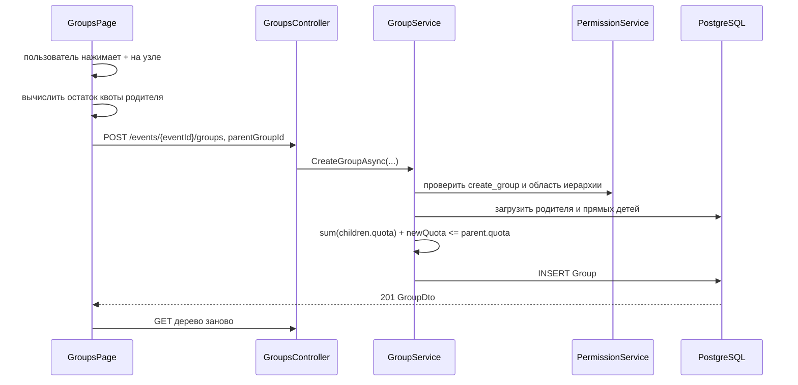

# Вкладка «Группы»: пользовательская логика и архитектура

Документ описывает текущее поведение групп в контексте мероприятия. Он состоит из двух частей:

1. инструкция и правила для пользователя системы;
2. техническое описание для разработчика с отдельными разделами по frontend и backend.

Термины:

- **корневая группа** — единственная верхнеуровневая группа мероприятия с `ParentGroupId == null`;
- **родительская группа** — группа, внутри которой создаётся дочерняя;
- **ветка** — выбранная группа и все её потомки любой глубины;
- **квота группы** — максимальный объём, который может быть распределён между её прямыми дочерними группами; квота также участвует в проверке возможности создания гостей;
- **прямые дочерние группы** — только группы следующего уровня, без рекурсивного суммирования всех потомков.

---

# Часть 1. Для пользователя системы

## 1. Когда доступна вкладка

Вкладка **«Группы»** предназначена для пользователей с разрешением `create_group` в выбранном мероприятии.

Для стандартных ролей доступ выглядит так:

| Роль | Доступ к группам |
|---|---|
| `Administrator` | Да, стандартный администратор получает все разрешения |
| `Manager` | Да, стандартному менеджеру назначается `create_group` |
| `Approver` | Нет по умолчанию |
| Пользовательская роль | Да, если роли назначено `create_group` |

Разрешение проверяется для текущего мероприятия. Наличие такого же разрешения в другом мероприятии не даёт доступ к группам выбранного мероприятия.

## 2. Как устроено дерево

Группы отображаются в виде горизонтального дерева:

- корневая группа расположена слева;
- дочерние группы находятся справа от родительской;
- уровни соединены линиями;
- дерево поддерживает произвольную глубину;
- в заголовке показывается общее количество групп во всём дереве;
- при нехватке ширины дерево прокручивается горизонтально.

Карточка группы показывает:

- название;
- установленную квоту;
- иконку редактирования;
- кнопку `+` для создания дочерней группы;
- иконку удаления, если группа не является корневой.

## 3. Корневая группа

При создании мероприятия backend автоматически создаёт одну корневую группу:

- название — `РМГ`;
- квота — `500`;
- родитель отсутствует.

Поэтому отдельной общей кнопки **«Создать группу»** на странице нет. Любая новая группа создаётся только как дочерняя через `+` на существующей группе.

Корневую группу можно переименовать и изменить её квоту. Удалить её нельзя: иконка удаления отсутствует, а прямой запрос на удаление также отклоняется backend.

## 4. Создание дочерней группы

Чтобы создать группу:

1. нажмите `+` на нужной родительской группе;
2. в модальном окне проверьте название выбранной родительской группы и доступный остаток её квоты;
3. заполните обязательные поля **«Название»** и **«Квота»**;
4. нажмите **«Создать»**.

Родитель не выбирается отдельным полем: им всегда является узел, на котором был нажат `+`. В запрос отправляется ID этого узла.

### Правило квоты при создании

Для родительской группы должно выполняться условие:

```text
сумма квот существующих прямых дочерних групп + квота новой группы
    <= квота родительской группы
```

Пример: квота родителя равна `100`, а существующим дочерним группам выделено `30` и `40`. Для новой группы доступно не более `30`.

Модальное окно:

- рассчитывает доступный остаток;
- устанавливает его как максимальное значение поля;
- блокирует отправку при превышении;
- использует те же компактные и адаптивные стили, что и форма создания сотрудника.

Backend повторно рассчитывает квоту перед сохранением. Это защищает данные, если дерево устарело или несколько пользователей создают группы одновременно.

Нулевая квота технически допустима. Отрицательная квота запрещена.

## 5. Редактирование группы

Редактирование открывается по иконке карандаша. Изменить можно:

- название;
- квоту.

Для новой квоты действуют два ограничения.

### Нижняя граница

Квота не может стать меньше суммы квот прямых дочерних групп:

```text
новая квота группы >= сумма квот её прямых дочерних групп
```

Например, если у группы есть дочерние квоты `20` и `30`, квоту самой группы нельзя уменьшить ниже `50`.

### Верхняя граница

Для некорневой группы изменение не должно привести к превышению квоты её родителя:

```text
сумма квот соседних групп + новая квота редактируемой группы
    <= квота родителя
```

В модальном окне показываются рассчитанные минимальное и, для некорневой группы, максимальное значения. Те же проверки повторяются на backend.

После успешного сохранения дерево загружается повторно.

## 6. Удаление группы и ветки

Удаление доступно по иконке корзины у всех групп, кроме корневой.

Перед запросом открывается модальное окно приложения с кнопками **«Нет»** и **«Да, удалить»**. Браузерное окно `confirm` не используется. Во время выполнения запроса модалку нельзя закрыть.

Если удаляемая группа является родительской, вместе с ней удаляются все дочерние группы на всех уровнях. Удаление необратимо.

Ветка не может быть удалена, если хотя бы в одной входящей в неё группе есть:

- сотрудник;
- гость.

Система не удаляет и не переносит связанных людей автоматически. Сначала их нужно удалить или вручную переназначить в группы вне удаляемой ветки.

Корневая группа защищена отдельно и не удаляется даже прямым API-запросом.

## 7. Область управления

Одного разрешения `create_group` недостаточно для произвольной работы со всем мероприятием. Backend разрешает создавать, редактировать и удалять группы только в области группы текущего пользователя:

- в собственной группе пользователя;
- в любой её дочерней группе любой глубины.

Группа из другой ветки недоступна для изменения. Для администратора, назначенного в корневую группу, областью управления является всё дерево.

Frontend сейчас показывает действия на всех загруженных узлах, а окончательное ограничение области выполняет backend. При попытке изменить недоступную группу запрос будет отклонён.

## 8. Ошибки и адаптивность

Пользователь получает отдельные состояния для:

- загрузки дерева;
- отсутствия групп;
- ошибки загрузки;
- ошибки создания;
- ошибки редактирования;
- ошибки удаления.

Формы создания и редактирования:

- на широком экране используют две колонки;
- на экранах до `640 px` переходят в одну колонку;
- используют общие стили модалок сотрудников;
- блокируют поля и кнопки во время сохранения.

На мобильном устройстве карточки остаются расположенными слева направо, а контейнер дерева получает горизонтальную прокрутку.

---

# Часть 2. Для разработчика

## 1. Общая модель и инварианты

```text
Event
  └── Group (root, parent_group_id = null)
        ├── Group
        │     ├── Group
        │     └── Group
        └── Group

Group
  ├── event_id
  ├── parent_group_id -> Group.id
  ├── name
  ├── quota
  ├── Users[]
  └── Guests[]
```

Основные инварианты:

1. при штатном создании Event создаётся одна корневая Group;
2. корень имеет `ParentGroupId == null` и не удаляется через Groups API;
3. квота неотрицательна;
4. сумма квот прямых детей не превышает квоту родителя;
5. при уменьшении квота группы не может стать меньше суммы квот её прямых детей;
6. имена групп уникальны в пределах мероприятия благодаря индексу `(event_id, name)`;
7. управление ограничено собственной группой пользователя и её потомками;
8. ветка с User или Guest не удаляется.

## 2. Основные потоки

### Создание



### Редактирование

```text
PUT группы
  -> проверить Event и область управления
  -> проверить quota >= 0
  -> проверить quota >= sum(прямых детей)
  -> если есть родитель:
       sum(соседей) + quota <= parent.quota
  -> обновить name и quota
  -> SaveChanges
```

### Удаление

```text
DELETE группы
  -> проверить Event и область управления
  -> запретить ParentGroupId == null
  -> breadth-first получить всех потомков
  -> проверить отсутствие User и Guest во всей ветке
  -> пометить группы на удаление от листьев к выбранному узлу
  -> SaveChanges
```

Удаление выполняется от наиболее глубоких потомков к родителю из-за `DeleteBehavior.Restrict` на самоссылочной связи Group.

## 3. Frontend

### 3.1. Файлы и ответственность

| Файл | Компонент / тип | Ответственность |
|---|---|---|
| `frontend/src/pages/GroupsPage.tsx` | `GroupsPage`, `GroupNode` | Загрузка и рекурсивный рендер дерева, расчёты квот, модалки создания/редактирования/удаления, вызовы API |
| `frontend/src/pages/EventSettingsPage.tsx` | `EventSettingsPage` | Видимость вкладки в desktop/mobile-навигации |
| `frontend/src/components/ProtectedRoute.tsx` | `ProtectedRoute` | Проверка SID, временного пароля и `create_group` для прямого маршрута |
| `frontend/src/components/Modal.tsx` | `Modal` | Общая модалка, Escape, backdrop, блокировка прокрутки страницы |
| `frontend/src/contexts/AuthContext.tsx` | `AuthProvider`, `useAuth` | Текущий Event, профиль и permissions, восстановление после F5 |
| `frontend/src/services/apiClient.ts` | `ApiClient` | `getGroupTree`, `createGroup`, `updateGroup`, `deleteGroup` |
| `frontend/src/types/index.ts` | `GroupDto`, `GroupTreeDto`, request DTO | TypeScript-контракты групп |
| `frontend/src/utils/groups.ts` | `flattenGroups`, `groupNameById` | Использование дерева групп в формах сотрудников и гостей |
| `frontend/src/App.tsx` | маршруты | Защищённый маршрут `/events/:eventId/groups` |
| `frontend/src/index.css` | CSS | Горизонтальное дерево, соединительные линии, действия узла, общие стили модалок и mobile media query |

### 3.2. Состояние `GroupsPage`

Основные группы состояния:

- данные: `groups`, `loading`, `error`;
- общий статус мутации: `saving`;
- создание: `parentGroup`, `form`;
- редактирование: `editingGroup`, `editForm`;
- удаление: `deleteGroup`.

Открытая модалка определяется наличием соответствующего объекта Group, отдельные boolean-флаги не используются.

### 3.3. Рекурсивный рендер

`GroupNode` получает:

- текущую группу;
- родителя текущей группы;
- признак `isRoot`;
- callbacks создания, редактирования и удаления.

Родитель нужен frontend для вычисления верхней границы при редактировании. `isRoot` передаётся только элементам верхнего массива и скрывает кнопку удаления.

`countGroups` рекурсивно считает все узлы. CSS строит дерево через flex/grid, псевдоэлементы соединительных линий и вложенные `.group-tree-children`.

### 3.4. Расчёты квот

При создании:

```ts
available = parent.quota - sum(parent.children[].quota)
```

При редактировании:

```ts
minimum = sum(group.children[].quota)
maximum = parent.quota - sum(parent.children кроме group)
```

У корня `maximum` отсутствует. Ограничения передаются в HTML-поля как `min` и `max` и дополнительно участвуют в `disabled` кнопки отправки.

Frontend-проверка нужна для интерфейса, но не считается доверенной: сервер повторяет все проверки.

### 3.5. Права и восстановление профиля

- маршрут обёрнут в `ProtectedRoute requiredPermission="create_group"`;
- `GroupsPage` использует `currentUser?.permissions.includes("create_group") ?? false`;
- `AuthProvider` во время первоначального восстановления показывает общий экран загрузки и повторно получает `/me` после F5;
- после загрузки дерева все мутации завершаются повторным `GET`.

Текущая особенность: в `EventSettingsPage` видимость ссылки вычисляется через `currentUser?.permissions.includes("create_group") ?? true`, а в `ProtectedRoute` отказ выполняется только если `currentUser` уже существует. Обычно это перекрывается общим `loading` в `AuthProvider`, но безопасным значением по умолчанию для обоих мест должен быть `false`.

## 4. Backend

### 4.1. API и контракты

| Файл | Класс / контракт | Ответственность |
|---|---|---|
| `corebackend/src/Api/Controllers/GroupsController.cs` | `GroupsController` | GET дерева, POST, PUT, DELETE, маппинг DTO |
| `corebackend/src/Api/Contracts/GroupContracts.cs` | group DTO | `GroupDto`, `GroupTreeDto`, `CreateGroupRequest`, `UpdateGroupRequest` |
| `corebackend/src/WebApi/Program.cs` | policy setup | Регистрация `CanCreateGroup` |

Все пути имеют префикс `/api`.

| Метод и путь | Назначение | Защита | Ответ |
|---|---|---|---|
| `GET /events/{eventId}/groups` | Получить дерево произвольной глубины | `[Authorize]` | `GroupTreeDto[]` |
| `POST /events/{eventId}/groups` | Создать дочернюю группу | `CanCreateGroup` | `201 GroupDto` |
| `PUT /events/{eventId}/groups/{groupId}` | Изменить название и квоту | `CanCreateGroup` | `204` |
| `DELETE /events/{eventId}/groups/{groupId}` | Удалить некорневую ветку | `CanCreateGroup` | `204` |

`CreateGroupRequest` содержит `name`, `quota`, `parentGroupId`. UI всегда передаёт `parentGroupId`; если другой клиент передаст `null`, сервис использует группу текущего пользователя.

`UpdateGroupRequest` содержит только `name` и `quota`. Перемещение группы к другому родителю через API не поддерживается.

### 4.2. Application

| Файл | Тип | Ответственность |
|---|---|---|
| `corebackend/src/Application/Entities/Group.cs` | `Group` | Иерархическая сущность, квота и navigation properties |
| `corebackend/src/Application/Services/IGroupService.cs` | `IGroupService` | Контракт чтения и мутаций групп |
| `corebackend/src/Application/Services/IPermissionService.cs` | `IPermissionService` | Контракт permission и проверок иерархии |
| `corebackend/src/Application/Repositories/IGroupRepository.cs` | `IGroupRepository` | Получение групп, детей и всех потомков, CRUD |
| `corebackend/src/Application/Repositories/IUserRepository.cs` | `IUserRepository` | Проверка сотрудников в удаляемой ветке |
| `corebackend/src/Application/Repositories/IGuestRepository.cs` | `IGuestRepository` | Проверка гостей в удаляемой ветке |

### 4.3. Infrastructure

| Файл | Класс | Ответственность |
|---|---|---|
| `Infrastructure/Services/GroupService.cs` | `GroupService` | Права, создание, формулы квот, изменение, рекурсивное удаление |
| `Infrastructure/Services/PermissionService.cs` | `PermissionService` | `create_group`, группа пользователя, проверка собственной группы и потомков |
| `Infrastructure/Services/EventService.cs` | `EventService` | Автоматическое создание корневой группы |
| `Infrastructure/Services/GuestService.cs` | `GuestService` | Использование квоты группы при создании гостей |
| `Infrastructure/Services/RoleService.cs` | `RoleService` | Назначает `create_group` стандартным Administrator и Manager |
| `Infrastructure/Repositories/GroupRepository.cs` | `GroupRepository` | EF Core-запросы дерева, детей и обход потомков в ширину |
| `Infrastructure/Repositories/UserRepository.cs` | `UserRepository` | `GetByGroupIdAsync` для защиты удаления |
| `Infrastructure/Repositories/GuestRepository.cs` | `GuestRepository` | `GetByGroupIdAsync` для защиты удаления |
| `Infrastructure/Data/Configurations/GroupConfiguration.cs` | `GroupConfiguration` | Таблица, индекс, self-FK и ограничения удаления |
| `Infrastructure/Data/ApplicationDbContext.cs` | `ApplicationDbContext` | `DbSet<Group>` и применение конфигураций |
| `Infrastructure/Authorization/PermissionRequirement.cs` | requirement | Описание разрешения policy |
| `Infrastructure/Authorization/PermissionAuthorizationHandler.cs` | handler | Извлекает `eventId` и проверяет permission |
| `Infrastructure/DependencyInjection.cs` | `AddInfrastructure` | Регистрация GroupService и репозиториев |
| `Infrastructure/Migrations/20260901111221_InitialCreate.cs` | единая начальная миграция | Создаёт таблицу `groups`, индексы, FK и корневую bootstrap-группу `РМГ` с квотой 500 |

### 4.4. Загрузка дерева

`GroupService.GetGroupHierarchyAsync` загружает все группы мероприятия через `GetByEventIdAsync`, после чего оставляет элементы с `ParentGroupId == null`. Поскольку все сущности отслеживаются одним EF Core context, relationship fixup наполняет `ChildGroups` на каждом уровне. `GroupsController.MapToTreeDtos` затем рекурсивно строит DTO.

Получение только `GetRootGroupsByEventAsync` с одним `Include(ChildGroups)` показало бы только один дочерний уровень, поэтому для текущего дерева используется загрузка полного набора мероприятия.

### 4.5. Проверка permissions и области

Policy `CanCreateGroup` зарегистрирована как:

```text
PermissionRequirement("create_group", requiresGroup: true)
```

Для POST policy проверяет наличие permission, а `CreateGroupAsync` дополнительно вызывает `CanCreateGroupInParentAsync`.

Для PUT и DELETE после policy сервис повторно:

1. проверяет `create_group`;
2. получает группу пользователя в Event;
3. разрешает целевую группу, если она является собственной группой пользователя или её потомком;
4. проверяет принадлежность целевой группы `eventId` из маршрута.

Это не позволяет подставить ID группы другого мероприятия или соседней ветки.

### 4.6. Схема данных и ограничения БД

Таблица `corebackend.groups` содержит:

- `id`;
- `event_id`;
- nullable `parent_group_id`;
- `name` длиной до 255 символов;
- `quota`;
- `created_at`.

Ограничения:

- уникальный индекс `(event_id, name)`;
- Event → Groups: `Cascade`;
- Parent Group → ChildGroups: `Restrict`;
- Group → Users: `Restrict`;
- Group → Guests: `Restrict`.

Из-за `Restrict` сервис явно проверяет связанные User/Guest и удаляет дочерние группы раньше родителей. Удаление всего Event остаётся каскадным относительно групп.

## 5. Квоты и взаимодействие с гостями

`GroupService` проверяет распределение квоты только между прямыми дочерними группами.

`GuestService` при создании гостя использует другую формулу:

```text
availableForGuest = group.quota
                  - sum(directChildren.quota)
                  - count(nonRejectedGuestsInGroup)
```

Гости в дочерних группах не вычитаются напрямую из квоты родителя: их вместимость уже зарезервирована квотой дочерней группы.

Важная текущая граница: создание/редактирование дочерней группы в `GroupService` не вычитает уже созданных гостей самого родителя. Поэтому совокупность `children quota + guests directly in parent` может превысить квоту после последующего перераспределения групп. Если требуется единый строгий инвариант, проверки GroupService должны учитывать гостей родительской группы так же, как GuestService.

## 6. Текущие особенности и ограничения

1. **`UsedQuota` и `AvailableQuota` в Groups API пока не рассчитаны.** `GroupsController` возвращает `UsedQuota = 0`, а `AvailableQuota = group.Quota`. Текущий `GroupsPage` не доверяет этим полям и вычисляет остаток из `quota` и `children`.
2. **GET защищён слабее мутаций.** `GET /groups` требует только аутентификацию, хотя вкладка и маршрут frontend требуют `create_group`.
3. **Навигация временно использует небезопасный default.** В `EventSettingsPage` для `canOpenGroups` сейчас указано `?? true`; рекомендуется заменить на `?? false`.
4. **Frontend показывает действия на всём дереве.** Область собственной ветки вычисляет только backend, поэтому пользователь может увидеть действие, которое завершится `403`.
5. **Ровно один корень обеспечивается штатным сценарием, а не ограничением БД.** `EventService` создаёт один корень, но схема допускает ручное создание нескольких записей с `parent_group_id = null`.
6. **Название уникально во всём Event, а не только среди соседей.** Две группы в разных ветках не могут иметь одинаковое имя.
7. **Нет endpoint перемещения группы.** `parent_group_id` после создания не редактируется.
8. **Проверка и сохранение квот не заключены в отдельную транзакцию с блокировкой.** При конкурентных запросах теоретически возможна гонка между чтением суммы и вставкой/обновлением.
9. **Удаление ветки выполняет отдельные запросы для сотрудников и гостей каждой группы.** Для очень больших деревьев это N+1-сценарий; при необходимости следует добавить агрегированную проверку в репозитории.
10. **Числовой идентификатор из SID — LoginId.** Проверки policy и области управления ищут профиль строго по паре `(LoginId, EventId)`, а получение permissions уже найденного профиля использует `User.Id`.
11. **Ошибки уникального индекса не преобразуются GroupService в доменное сообщение.** Конфликт имени может вернуться как необработанная ошибка БД, а frontend покажет общее сообщение.

## 7. Проверка и запуск после изменений

Frontend:

```powershell
cd C:\git\rmgevents\frontend
npm.cmd run build
```

Backend:

```powershell
cd C:\git\rmgevents\corebackend
dotnet build --no-restore
```

После любых изменений backend контейнер пересобирается и перезапускается:

```powershell
cd C:\git\rmgevents
docker compose -f deploy\docker-compose.local.yml up -d --build corebackend
docker compose -f deploy\docker-compose.local.yml ps corebackend
docker compose -f deploy\docker-compose.local.yml logs --tail 50 corebackend
```

Backend доступен по `http://localhost:5000`, frontend в локальной compose-конфигурации — по `http://localhost:5173`.
