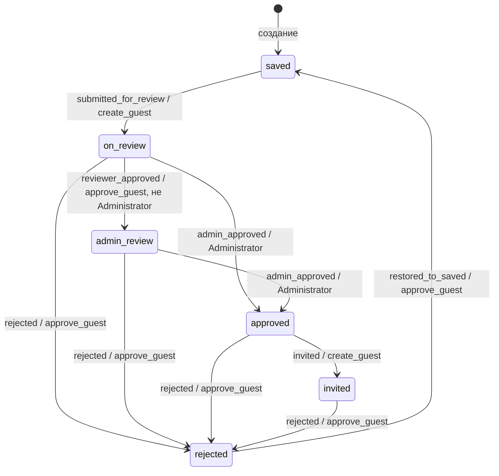

# Вкладка «Гости»: пользовательская логика и архитектура

Документ описывает текущее поведение вкладки гостей в рамках выбранного мероприятия. Он предназначен одновременно для пользователя системы и разработчика, которому нужно воспроизвести функциональность на другом frontend/backend или продолжить её развитие.

Документ отражает фактическую реализацию на момент написания: роли `Administrator`, `Manager`, `Creator`, строгую статусную модель, групповую область доступа, историю решений и интерфейс со статусом-кнопкой.

---

# Часть 1. Для пользователя системы

## 1. Назначение вкладки

Вкладка **«Гости»** является основной страницей мероприятия и открывается по адресу:

```text
/events/{eventId}/guests
```

При переходе на `/events/{eventId}` пользователь автоматически перенаправляется на гостей. Вкладка доступна любому авторизованному участнику выбранного мероприятия. Набор видимых действий зависит от роли, permissions и группы сотрудника.

## 2. Стандартные роли

В системе используются следующие стандартные роли:

| Роль | Permissions, связанные с гостями | Возможности |
|---|---|---|
| `Administrator` | `create_guest`, `approve_guest` | Создание, редактирование, удаление, отправка на согласование, административное согласование, отклонение, восстановление, приглашение |
| `Manager` | `create_guest`, `approve_guest` | Создание, редактирование, удаление, отправка, обычное согласование, отклонение, восстановление, приглашение |
| `Creator` | `create_guest` | Создание, редактирование, удаление, отправка на согласование и приглашение уже согласованного администратором гостя |

Пользовательская роль получает те же возможности, если ей назначены соответствующие permissions. Исключение — административное согласование: оно дополнительно требует, чтобы имя роли сотрудника было `Administrator` без учёта регистра.

## 3. Область групп

Все изменяющие действия ограничены иерархией групп.

Сотрудник может работать с гостем, если группа гостя:

1. совпадает с группой сотрудника; или
2. является дочерней группой на любом уровне вложенности.

Нельзя выполнять действия с гостями:

- родительской группы сотрудника;
- соседней ветки;
- другого мероприятия.

Это правило проверяется на frontend для видимости кнопок и повторно на backend. Backend является окончательным источником решения о доступе.

## 4. Таблица гостей

Таблица показывает:

- имя гостя;
- email и телефон;
- группу;
- текущий статус и доступное следующее действие;
- дату создания;
- иконки редактирования и удаления.

Отдельной колонки согласования нет. Управление статусом встроено в колонку **«Статус»**.

Если пользователю доступен следующий переход, статус является кнопкой:

- без наведения показывает текущий статус;
- при наведении или клавиатурном фокусе показывает название действия;
- ширина кнопки не меняется при подмене текста, поэтому таблица не сдвигается.

При выполнении статусного действия весь список не перезагружается. Backend возвращает обновлённого гостя, а frontend заменяет только соответствующую строку вместе с её историей.

## 5. Статусы и переходы

Технические и пользовательские статусы:

| Техническое значение | Отображение | Цвет |
|---|---|---|
| `saved` | Сохранён | Светло-синий |
| `on_review` | На согласовании | Светло-синий отдельного оттенка |
| `admin_review` | На согласовании у администратора | Светло-оранжевый |
| `approved` | Согласован Администратором | Светло-фиолетовый |
| `invited` | Приглашён | Зелёный |
| `rejected` | Отклонён | Красный |

Основная цепочка:

```text
Сохранён
  └─ create_guest: Отправить на согласование
       ↓
На согласовании
  ├─ approve_guest, не Administrator: Согласовать
  │    ↓
  │  На согласовании у администратора
  │    └─ Administrator: Согласовать
  │         ↓
  └─ Administrator: Согласовать напрямую
       ↓
Согласован Администратором
  └─ create_guest: Пригласить
       ↓
Приглашён
```

Administrator может согласовать гостя непосредственно из `on_review`. В этом случае обычное согласование пропускается, а в цепочке появляется жёлтый этап с минусом.

### Матрица переходов

| Исходный статус | Действие в UI | Новый статус | Требование |
|---|---|---|---|
| `saved` | Отправить на согласование | `on_review` | `create_guest` |
| `on_review` | Согласовать | `admin_review` | `approve_guest`, роль не Administrator |
| `on_review` | Согласовать | `approved` | роль Administrator и `approve_guest` |
| `admin_review` | Согласовать | `approved` | роль Administrator и `approve_guest` |
| `approved` | Пригласить | `invited` | `create_guest` |
| любой, кроме `saved` и `rejected` | Отклонить | `rejected` | `approve_guest` |
| `rejected` | Восстановить в Сохранён | `saved` | `approve_guest` |

Любая попытка вызвать переход из неподходящего статуса отклоняется backend, даже если пользователь вручную сформировал HTTP-запрос.

## 6. Отклонение и восстановление

Отклонить гостя могут стандартные `Administrator` и `Manager`, потому что обе роли имеют `approve_guest`.

Отклонение доступно из:

- «На согласовании»;
- «На согласовании у администратора»;
- «Согласован Администратором»;
- «Приглашён».

Из «Сохранён» отклонять нельзя. Уже отклонённого гостя повторно отклонить нельзя.

Статус «Отклонён» превращается при наведении в кнопку **«Восстановить в Сохранён»**. После восстановления:

- текущим статусом становится `saved`;
- `ApprovedAt` очищается;
- начинается новый полный цикл;
- прежние решения не удаляются;
- прежний согласующий может согласовать гостя снова в новом цикле.

## 7. Создание гостя

Создать гостя может сотрудник с `create_guest` в собственной или дочерней группе.

Форма содержит:

| Поле | Обязательное | Ограничение |
|---|---:|---|
| Имя | Да | Строка до 255 символов на уровне БД |
| Email | Нет | HTML-поле типа `email`, до 255 символов в БД |
| Телефон | Нет | HTML-поле типа `tel`, до 20 символов в БД |
| Группа | Да | Только собственная группа и потомки |

Новый гость всегда создаётся в статусе `saved`.

Перед созданием backend проверяет доступную квоту выбранной группы:

```text
available = group.quota
          - sum(quota прямых дочерних групп)
          - count(неотклонённых гостей непосредственно в группе)
```

Если остаток равен нулю, создание запрещается.

## 8. Редактирование

Редактировать гостя может сотрудник с `create_guest` в своей области групп независимо от текущего статуса гостя.

Можно изменить:

- имя;
- email;
- телефон;
- группу.

Целевая группа также должна находиться в доступной ветке. При переносе неотклонённого гостя в другую группу проверяется квота новой группы. Для отклонённого гостя квота при переносе не проверяется, потому что отклонённые гости не занимают места.

Кнопка **«Сохранить»** в форме редактирования:

- выключена сразу после открытия;
- включается только после фактического изменения данных;
- снова выключается при возврате исходных значений;
- не считает пробелы по краям самостоятельным изменением.

Форма использует две колонки. Цепочка согласования занимает полную ширину формы.

## 9. Удаление

Удалить гостя может сотрудник с `create_guest` в своей области групп. Перед удалением показывается модальное подтверждение.

Удаление каскадно удаляет историю решений гостя. Восстановить удалённого гостя через текущий интерфейс нельзя.

## 10. Цепочка согласования

Цепочка отображается в форме редактирования как горизонтальный progress bar.

Обозначения:

- зелёный круг с галочкой — действие выполнено;
- серый пустой круг — ожидающий этап;
- жёлтый круг с минусом — обычное согласование пропущено Administrator;
- красный круг с крестом — гость отклонён;
- под каждым этапом показываются исполнитель, дата и время.

История не сворачивается до одного текущего состояния. Если гость был отклонён и восстановлен, progress bar содержит:

1. этапы первого цикла;
2. красный этап отклонения;
3. зелёный этап «Восстановлен в Сохранён»;
4. этапы нового цикла.

На мобильном экране горизонтальная прокрутка применяется только к progress bar. Остальная форма остаётся в ширине модального окна.

---

# Часть 2. Для разработчика

## 1. Состояние-машина

Статусы должны рассматриваться как конечный автомат, а не как произвольная строка.



Переходы проверяются в `GuestService`, а не выводятся только из permissions контроллера. Policy отвечает за грубую проверку разрешения; сервис проверяет статус, точную роль и групповую область.

## 2. История решений

Текущий статус хранится в `Guest.Status`, а история — отдельными `GuestDecision`.

Типы действий:

| `GuestDecision.Action` | Значение |
|---|---|
| `submitted_for_review` | Гость отправлен на согласование |
| `reviewer_approved` | Выполнено обычное согласование |
| `admin_approved` | Выполнено административное согласование |
| `invited` | Гость приглашён |
| `rejected` | Гость отклонён |
| `restored_to_saved` | Отклонённый гость восстановлен в «Сохранён» |

Каждая запись содержит:

- `GuestId`;
- nullable `ActorUserId`;
- снимок имени `ActorName`;
- `Action`;
- `CreatedAt`.

Снимок имени нужен, чтобы история оставалась читаемой после переименования или удаления сотрудника. FK на User настроен как `SET NULL`; FK на Guest — `CASCADE`.

## 3. Схема данных

### `corebackend.guests`

Основные поля:

- `id`;
- `event_id`;
- `group_id`;
- `created_by_user_id`;
- `name`;
- `email`;
- `phone`;
- `status` длиной до 30 символов, default `saved`;
- `meta` JSONB;
- `created_at`;
- `approved_at`.

`ApprovedAt` устанавливается при административном согласовании и очищается при восстановлении в `saved`. Обычное согласование, приглашение и отклонение его не меняют.

### `corebackend.guest_decisions`

- `id`;
- `guest_id`;
- nullable `actor_user_id`;
- `actor_name`;
- `action`;
- `created_at`;
- индекс `(guest_id, created_at)`;
- индекс по `actor_user_id`.

## 4. Backend: файлы и ответственность

| Файл | Ответственность |
|---|---|
| `Application/Entities/Guest.cs` | Данные гостя, текущий статус, связь с историей |
| `Application/Entities/GuestDecision.cs` | Неизменяемый факт действия над гостем |
| `Application/Services/IGuestService.cs` | Контракт чтения, CRUD и статусных переходов |
| `Application/Services/IPermissionService.cs` | Permissions и проверка области групп |
| `Application/Repositories/IGuestRepository.cs` | Контракт EF-операций гостей |
| `Infrastructure/Services/GuestService.cs` | Бизнес-правила, статусы, permissions, квоты и история |
| `Infrastructure/Services/PermissionService.cs` | Своя группа/потомки и получение профиля по LoginId/EventId |
| `Infrastructure/Repositories/GuestRepository.cs` | Загрузка Group и Decisions, CRUD и подсчёт квоты |
| `Infrastructure/Data/Configurations/GuestConfiguration.cs` | Таблица guests, длины, FK и default статуса |
| `Infrastructure/Data/Configurations/GuestDecisionConfiguration.cs` | Таблица истории, индексы и FK |
| `Api/Controllers/GuestsController.cs` | HTTP endpoints, policies, получение LoginId из claims, маппинг DTO |
| `Api/Contracts/GuestContracts.cs` | DTO и request-контракты |
| `WebApi/Program.cs` | Policies `CanCreateGuest` и `CanApproveGuest` |

## 5. Backend: API

Все пути имеют префикс `/api`.

| Метод и путь | Назначение | Policy | Успешный ответ |
|---|---|---|---|
| `GET /events/{eventId}/guests` | Получить гостей и историю | `[Authorize]` | `GuestDto[]` |
| `POST /events/{eventId}/guests` | Создать гостя | `CanCreateGuest` | `201 GuestDto` |
| `PUT /events/{eventId}/guests/{guestId}` | Изменить гостя | `CanCreateGuest` | `200 GuestDto` |
| `DELETE /events/{eventId}/guests/{guestId}` | Удалить гостя | `CanCreateGuest` | `204` |
| `POST /events/{eventId}/guests/{guestId}/submit-for-review` | `saved → on_review` | `CanCreateGuest` | `200 GuestDto` |
| `POST /events/{eventId}/guests/{guestId}/approve` с `approve=true` | Обычное или административное согласование | `CanApproveGuest` | `200 GuestDto` |
| тот же endpoint с `approve=false` | Отклонение | `CanApproveGuest` | `200 GuestDto` |
| `POST /events/{eventId}/guests/{guestId}/invite` | `approved → invited` | `CanCreateGuest` | `200 GuestDto` |
| `POST /events/{eventId}/guests/{guestId}/restore-to-saved` | `rejected → saved` | `CanApproveGuest` | `200 GuestDto` |

`ApproveGuestRequest` сейчас содержит одновременно `GuestId` и `Approve`, хотя ID уже присутствует в маршруте. Контроллер использует маршрутный `guestId`; поле тела избыточно и может быть удалено при следующем изменении контракта.

### Коды ответов

- отсутствие policy обычно приводит к `403`;
- `UnauthorizedAccessException` из сервиса преобразуется в `Forbid`;
- неправильный статус, чужое мероприятие, группа или переполненная квота возвращаются как `400` через `InvalidOperationException`;
- отсутствующий guest внутри сервиса в текущей реализации также обычно становится `400`, а не `404`;
- после успешной мутации endpoint повторно загружает Guest с Group и Decisions и возвращает полный `GuestDto`.

## 6. Backend: алгоритмы переходов

### Отправка

```text
проверить create_guest
проверить свою/дочернюю группу
потребовать status == saved
добавить submitted_for_review
установить status = on_review
сохранить
```

### Согласование

```text
проверить approve_guest
проверить свою/дочернюю группу
загрузить User и Role текущего LoginId в Event

если status == on_review и Role != Administrator:
    добавить reviewer_approved
    status = admin_review

иначе если status == on_review и Role == Administrator:
    добавить admin_approved
    status = approved
    approved_at = now

иначе если status == admin_review и Role == Administrator:
    добавить admin_approved
    status = approved
    approved_at = now

иначе: запретить переход
```

### Приглашение

```text
проверить create_guest
проверить свою/дочернюю группу
потребовать status == approved
добавить invited
status = invited
```

### Отклонение

```text
проверить approve_guest
проверить свою/дочернюю группу
запретить saved и rejected
добавить rejected
status = rejected
```

### Восстановление

```text
проверить approve_guest
проверить свою/дочернюю группу
потребовать status == rejected
добавить restored_to_saved
status = saved
approved_at = null
```

## 7. DTO

`GuestDto` содержит:

```text
id, eventId, groupId, groupName,
name, email, phone,
status, createdAt, approvedAt,
decisions[]
```

`GuestDecisionDto` содержит:

```text
id, actorUserId, action, actorName, createdAt
```

Решения сортируются контроллером по `CreatedAt` перед отправкой.

## 8. Frontend: файлы и ответственность

| Файл | Ответственность |
|---|---|
| `frontend/src/pages/GuestsPage.tsx` | Список, CRUD-модалки, вычисление области групп, статусные действия, progress bar |
| `frontend/src/services/apiClient.ts` | Методы всех guest endpoints |
| `frontend/src/types/index.ts` | `GuestDto`, `GuestDecisionDto`, request-типы и union статусов |
| `frontend/src/utils/groups.ts` | Преобразование дерева групп в список формы |
| `frontend/src/contexts/AuthContext.tsx` | `currentUser`, роль, groupId и permissions |
| `frontend/src/pages/EventSettingsPage.tsx` | Ссылка на вкладку гостей |
| `frontend/src/App.tsx` | Маршрут гостей и redirect мероприятия |
| `frontend/src/index.css` | Цвета статусов, hover-кнопка, таблица, модалка и progress bar |

## 9. Frontend: состояние и загрузка

Основное состояние `GuestsPage`:

- `guests` — строки таблицы;
- `groups` — дерево для области и форм;
- `loading`, `saving`, `error`;
- `isCreateModalOpen`;
- `editingGuest`;
- `deleteGuest`;
- `formData`.

При первом открытии `loadData` параллельно загружает гостей и дерево групп.

После создания, редактирования или удаления сейчас выполняется полная загрузка данных. После статусных действий используется другой путь:

```ts
const updatedGuest = await apiClient.someStatusAction(...);
setGuests(current => current.map(item =>
  item.id === updatedGuest.id ? updatedGuest : item));
```

Это сохраняет прокрутку и ширину таблицы. Если редактируемый гость открыт в модалке, `editingGuest` также заменяется обновлённым DTO.

## 10. Frontend: permissions и действия

Базовые признаки:

```ts
canCreate  = permissions.includes("create_guest")
canApprove = permissions.includes("approve_guest")
isAdministrator = roleName.toLowerCase() === "administrator"
```

`collectScopeIds` рекурсивно находит группу текущего пользователя и всех потомков. Действие показывается только если `scopeIds.has(guest.groupId)`.

Условия статусной кнопки:

```text
saved:
  create_guest -> «Отправить на согласование»

on_review:
  approve_guest -> «Согласовать»

admin_review:
  Administrator + approve_guest -> «Согласовать»

approved:
  create_guest -> «Пригласить»

rejected:
  approve_guest -> «Восстановить в Сохранён»
```

Иконка отклонения показывается рядом со статусом при `approve_guest`, если статус не `saved` и не `rejected`.

Frontend-проверки не заменяют backend-проверки. Их назначение — скрыть заведомо недоступные действия и улучшить UX.

## 11. Frontend: progress bar

Progress bar строится из `decisions`, отсортированных по времени.

Соответствия:

| Action | Этап |
|---|---|
| `submitted_for_review` | На согласовании |
| `reviewer_approved` | Согласован согласующим |
| `admin_approved` | Согласован Администратором |
| `invited` | Приглашён |
| `rejected` | Отклонён |
| `restored_to_saved` | Восстановлен в Сохранён |

Если внутри текущего цикла встречается `admin_approved` без предшествующего `reviewer_approved`, перед административным этапом вставляется вычисляемый `skipped`-этап. Он не хранится в БД.

После фактической истории компонент добавляет ожидающие этапы исходя из текущего статуса. Так пользователь видит не только прошлое, но и оставшуюся цепочку.

## 12. Миграции

Связанные миграции:

- `20260901111221_InitialCreate` — исходная таблица guests и три старых статуса;
- `20260902062459_AddGuestApprovalWorkflow` — `guest_decisions`, увеличение длины статуса и перенос старых approved/rejected;
- `20260902133649_UpdateGuestWorkflowStatuses` — default `saved`, новые статусы и переименование действия восстановления.

Последняя миграция преобразует:

```text
pending            -> saved
reviewer_approved  -> admin_review
admin_approved     -> approved
returned_to_review -> restored_to_saved
```

Для старых гостей с решениями согласования добавляется системное событие `submitted_for_review`, если такого события раньше не было.

## 13. Текущие особенности и ограничения

1. **GET гостей защищён только аутентификацией.** Любой авторизованный клиент может запросить список по известному `eventId`; frontend не скрывает саму вкладку по permission.
2. **GET возвращает всех гостей мероприятия.** Фильтрация списка по ветке группы не выполняется; область применяется только к действиям.
3. **`eventId` маршрута не сравнивается в контроллере с Event гостя.** Сервис проверяет permission и группу по фактическому `guest.EventId`, что защищает мутации, но контракт лучше усилить явной проверкой соответствия маршруту.
4. **Статусы и action-коды являются строками.** Enum/константы отсутствуют, поэтому опечатка обнаруживается только во время выполнения.
5. **Причина отклонения не хранится.** Есть только исполнитель и время.
6. **Создатель не показывается в DTO истории создания.** Первый этап progress bar показывает время `Guest.CreatedAt`, но не имя `CreatedByUser`.
7. **Редактирование разрешено в любом статусе.** Если после отправки поля должны блокироваться, потребуется отдельное бизнес-правило.
8. **Удаление разрешено в любом статусе при `create_guest`.** История удаляется каскадно.
9. **Квота и статус меняются без отдельной блокировки строк.** При конкурентных запросах возможны гонки проверки квоты или статуса.
10. **Одно согласование на цикл обеспечивается статусом, а не уникальным ограничением истории.** Повторный параллельный запрос теоретически может создать две записи до фиксации статуса.
11. **Administrator определяется по имени роли.** Переименование роли нарушит административный переход.
12. **`ActorName` — снимок, `ActorUserId` nullable.** Это намеренно сохраняет читаемость истории после удаления сотрудника.
13. **Frontend не обновляет квоты групп после одного статусного действия.** Строка гостя обновляется без скачка таблицы, но значения `availableQuota` в уже открытом списке групп могут оставаться устаревшими до следующей полной загрузки.

## 14. Рекомендуемый порядок повторной реализации

1. Создать `Guest` и `GuestDecision`, конфигурации EF и миграцию.
2. Ввести централизованные константы статусов и действий.
3. Реализовать `PermissionService.IsGroupInUserScopeAsync`.
4. Реализовать CRUD гостя с проверками `create_guest` и квоты.
5. Реализовать каждый статусный переход отдельным сервисным методом.
6. Для каждого перехода одновременно менять статус и добавлять историю в одном `SaveChangesAsync`.
7. Добавить policies и endpoints.
8. Возвращать после мутации полный `GuestDto` с отсортированной историей.
9. На frontend загрузить гостей, группы и профиль текущего сотрудника.
10. Вычислить доступную ветку групп и видимость действий.
11. Реализовать статус-кнопку с неизменной шириной и отдельную иконку отклонения.
12. После статусного действия заменять только одну строку.
13. Реализовать форму редактирования и горизонтальную историю циклов.
14. Проверить каждую роль, каждый статус, соседние группы и дочерние группы.

## 15. Матрица приёмочного тестирования

Минимальный набор сценариев:

| Сценарий | Ожидаемый результат |
|---|---|
| Creator создаёт гостя в своей группе | `saved`, успех |
| Creator создаёт гостя в дочерней группе | Успех |
| Creator создаёт гостя в соседней группе | `403`/запрет |
| Creator отправляет `saved` | `on_review`, история `submitted_for_review` |
| Creator пытается согласовать | Действия нет, backend запрещает |
| Manager согласует `on_review` | `admin_review` |
| Manager согласует `admin_review` | Запрет |
| Administrator согласует `on_review` | `approved`, жёлтый skipped в UI |
| Administrator согласует `admin_review` | `approved` |
| Creator приглашает `approved` | `invited` |
| Manager приглашает `approved` | `invited`, потому что Manager имеет `create_guest` |
| Creator приглашает до `approved` | Запрет |
| Manager отклоняет `saved` | Запрет |
| Manager отклоняет `on_review` | `rejected` |
| Administrator отклоняет `invited` | `rejected` |
| Creator восстанавливает rejected | Запрет |
| Manager восстанавливает rejected | `saved`, история сохранена |
| Повторный цикл после восстановления | Старые этапы видны, новые добавляются |
| Статусное действие в таблице | Меняется одна строка без общего loading |
| Наведение «Согласован Администратором» → «Пригласить» | Ширина таблицы не меняется |

## 16. Сборка и локальный запуск

Frontend:

```powershell
cd C:\git\rmgevents\frontend
npm.cmd run build
```

Backend:

```powershell
cd C:\git\rmgevents\corebackend
dotnet build CoreBackend.sln --no-restore
```

Пересборка только локального backend при остановленном frontend:

```powershell
cd C:\git\rmgevents
docker compose -f deploy\docker-compose.local.yml stop frontend
docker compose -f deploy\docker-compose.local.yml up -d --build --no-deps corebackend
docker compose -f deploy\docker-compose.local.yml ps -a
```

Проверка:

```powershell
Invoke-RestMethod http://localhost:5000/health
```

Ожидаемый ответ:

```json
{"status":"ok"}
```
