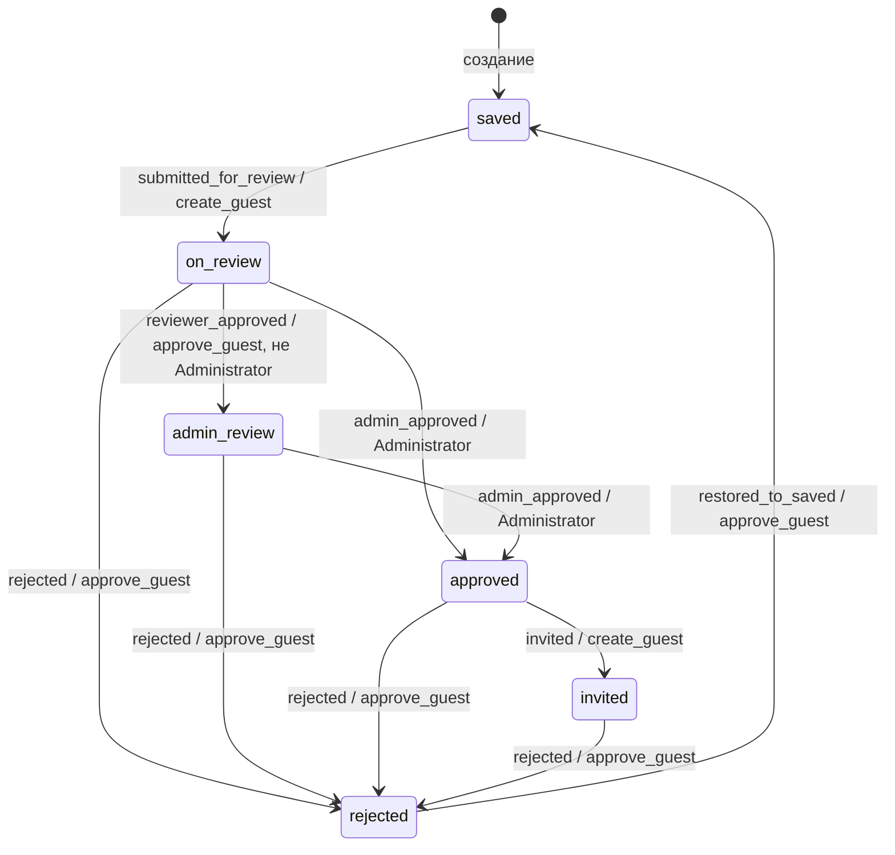

# Вкладка «Гости»: пользовательская логика и архитектура

Документ описывает текущее поведение вкладки гостей в рамках выбранного мероприятия. Он предназначен одновременно для пользователя системы и разработчика, которому нужно воспроизвести функциональность на другом frontend/backend или продолжить её развитие.

## QR-код и публичная карточка

При создании гостя сервер создаёт уникальный `public_id` (GUID). QR-код содержит ссылку `/guest/{publicId}`. В форме редактирования отображается QR-код и доступно скачивание PDF с QR и данными гостя. В строке гостя отдельная кнопка QR открывает ту же карточку в модальном окне.

Ссылка из QR открывает отдельную публичную страницу без авторизации. Она выводит данные гостя только для просмотра: ФИО, контакты, группу, категорию, метки, статус и дату создания. API для страницы: `GET /api/public/guests/{publicId}`. Идентификатор случайный и уникальный; изменение гостя не меняет ссылку.

Документ отражает фактическую реализацию на момент написания: роли `Administrator`, `Manager`, `Creator`, строгую статусную модель, групповую область доступа, историю решений, поиск, постраничный вывод, категории, метки, фильтры и интерфейс со статусом-кнопкой.

---

# Часть 1. Для пользователя системы

## 1. Назначение вкладки

Вкладка **«Гости»** является основной страницей мероприятия и открывается по адресу:

```text
/events/{eventId}/guests
```

При переходе на `/events/{eventId}` пользователь автоматически перенаправляется на гостей. Вкладка доступна любому авторизованному участнику выбранного мероприятия. Набор видимых действий зависит от роли, permissions и группы сотрудника.

## 2. Стандартные роли

В системе используются следующие стандартные роли:

| Роль | Permissions, связанные с гостями | Возможности |
|---|---|---|
| `Administrator` | `create_guest`, `approve_guest` | Создание, редактирование, удаление, отправка на согласование, административное согласование, отклонение, восстановление, приглашение |
| `Manager` | `create_guest`, `approve_guest` | Создание, редактирование, удаление, отправка, обычное согласование, отклонение, восстановление, приглашение |
| `Creator` | `create_guest` | Создание, редактирование, удаление, отправка на согласование и приглашение уже согласованного администратором гостя |

Пользовательская роль получает те же возможности, если ей назначены соответствующие permissions. Исключение — административное согласование: оно дополнительно требует, чтобы имя роли сотрудника было `Administrator` без учёта регистра.

## 3. Область групп

Все изменяющие действия ограничены иерархией групп.

Сотрудник может работать с гостем, если группа гостя:

1. совпадает с группой сотрудника; или
2. является дочерней группой на любом уровне вложенности.

Нельзя выполнять действия с гостями:

- родительской группы сотрудника;
- соседней ветки;
- другого мероприятия.

Это правило проверяется на frontend для видимости кнопок и повторно на backend. Backend является окончательным источником решения о доступе.

## 4. Таблица гостей

Таблица показывает:

- имя гостя;
- email;
- группу;
- категорию в виде широкой двунаправленной стрелки;
- метки в виде цветных бирок с точкой;
- кем создан: ФИО создателя и роль под ФИО;
- текущий статус и доступное следующее действие;
- дату и время создания;
- иконки редактирования и удаления.

Отдельной колонки согласования нет. Управление статусом встроено в колонку **«Статус»**.

Над таблицей есть строка поиска и фильтры:

- по статусу;
- по категории;
- по меткам.

Фильтр статуса содержит вариант «Все статусы» и все рабочие статусы гостя. Фильтр категории содержит вариант «Все категории». Фильтр меток позволяет выбрать несколько меток и сбросить выбранный набор.

Поиск и фильтры применяются вместе, результат остаётся постраничным.

Если пользователю доступен следующий переход, статус является кнопкой:

- без наведения показывает текущий статус;
- при наведении или клавиатурном фокусе показывает название действия;
- ширина кнопки не меняется при подмене текста, поэтому таблица не сдвигается.

При выполнении статусного действия весь список не перезагружается. Backend возвращает обновлённого гостя, а frontend заменяет только соответствующую строку вместе с её историей.

Если мероприятие завершено, вкладка гостей работает в режиме просмотра: список, пагинация и поиск доступны, но создание, редактирование, удаление и статусные переходы скрыты на frontend и запрещены на backend до возврата мероприятия в активные.

### Поиск на вкладке

Над таблицей находится строка поиска гостей текущего мероприятия. Поиск выполняется на backend по параметру `search` и применяется к имени, email и телефону, хотя телефон в основной таблице не выводится ради компактности. Frontend отправляет запрос с задержкой 450 мс после ввода.

Поиск запускается, когда введено не менее двух символов. Если введено меньше двух символов или строка очищена, показывается обычный список без фильтра. Совпадение выполняется без учёта регистра:

- точное совпадение выводится выше;
- совпадение с начала строки выводится ниже точного;
- прочее частичное совпадение выводится ниже совпадения с начала.

При активном поиске рядом со строкой отображается количество найденных записей. Если совпадений нет, вместо таблицы показывается пустое состояние.

### Фильтры категории и меток

Фильтр категории работает как single-select: можно выбрать одну категорию или вариант «Все категории».

Фильтр меток работает как multi-select. Если выбрано несколько меток, backend возвращает только тех гостей, у которых есть все выбранные метки одновременно:

```text
выбраны VIP и Спикер
→ гость должен иметь и VIP, и Спикер
```

При изменении статуса, категории или меток frontend сбрасывает список на первую страницу.

### Постраничный вывод

Список гостей загружается постранично. По умолчанию frontend запрашивает первую страницу по 20 гостей. Пользователь может выбрать размер страницы: 10, 20 или 50 записей. Под таблицей показываются диапазон текущей страницы, общее количество и кнопки перехода назад/вперёд.

Backend возвращает `items`, `totalCount`, `page` и `pageSize`. Если клиент запросил страницу больше последней доступной, backend возвращает последнюю доступную страницу.

## 5. Статусы и переходы

Технические и пользовательские статусы:

| Техническое значение | Отображение | Цвет |
|---|---|---|
| `saved` | Сохранён | Светло-зелёный |
| `on_review` | На согласовании | Светло-жёлтый |
| `admin_review` | На согласовании у администратора | Светло-оранжевый |
| `approved` | Согласован Администратором | Светло-фиолетовый |
| `invited` | Приглашён | Зелёный |
| `rejected` | Отклонён | Красный |

Основная цепочка:

```text
Сохранён
  └─ create_guest: Отправить на согласование
       ↓
На согласовании
  ├─ approve_guest, не Administrator: Согласовать
  │    ↓
  │  На согласовании у администратора
  │    └─ Administrator: Согласовать
  │         ↓
  └─ Administrator: Согласовать напрямую
       ↓
Согласован Администратором
  └─ create_guest: Пригласить
       ↓
Приглашён
```

Administrator может согласовать гостя непосредственно из `on_review`. В этом случае обычное согласование пропускается, а в цепочке появляется жёлтый этап с минусом.

### Матрица переходов

| Исходный статус | Действие в UI | Новый статус | Требование |
|---|---|---|---|
| `saved` | Отправить на согласование | `on_review` | `create_guest` |
| `on_review` | Согласовать | `admin_review` | `approve_guest`, роль не Administrator |
| `on_review` | Согласовать | `approved` | роль Administrator и `approve_guest` |
| `admin_review` | Согласовать | `approved` | роль Administrator и `approve_guest` |
| `approved` | Пригласить | `invited` | `create_guest` |
| любой, кроме `saved` и `rejected` | Отклонить | `rejected` | `approve_guest` |
| `rejected` | Восстановить в Сохранён | `saved` | `approve_guest` |

Любая попытка вызвать переход из неподходящего статуса отклоняется backend, даже если пользователь вручную сформировал HTTP-запрос.

## 6. Отклонение и восстановление

Отклонить гостя могут стандартные `Administrator` и `Manager`, потому что обе роли имеют `approve_guest`.

Отклонение доступно из:

- «На согласовании»;
- «На согласовании у администратора»;
- «Согласован Администратором»;
- «Приглашён».

Из «Сохранён» отклонять нельзя. Уже отклонённого гостя повторно отклонить нельзя.

Статус «Отклонён» превращается при наведении в кнопку **«Восстановить в Сохранён»**. После восстановления:

- текущим статусом становится `saved`;
- `ApprovedAt` очищается;
- начинается новый полный цикл;
- прежние решения не удаляются;
- прежний согласующий может согласовать гостя снова в новом цикле.

## 7. Создание гостя

Создать гостя может сотрудник с `create_guest` в собственной или дочерней группе.

Форма содержит:

| Поле | Обязательное | Ограничение |
|---|---:|---|
| Имя | Да | Строка до 255 символов на уровне БД |
| Email | Нет | HTML-поле типа `email`, до 255 символов в БД |
| Телефон | Нет | HTML-поле типа `tel`, до 20 символов в БД |
| Группа | Да | Только собственная группа и потомки |
| Категория | Нет | Можно выбрать одну категорию или «Без категории» |
| Метки | Нет | Можно выбрать несколько меток |

Новый гость всегда создаётся в статусе `saved`.

Категория и метки загружаются из справочников текущего мероприятия. Категория отображается в форме как двунаправленная стрелка; метки — как бирки с точкой. Повторный клик по выбранной метке снимает её с гостя.

В актуальном интерфейсе форма редактирования гостя разделена на две зоны:

- слева расположены основные поля гостя, выбор группы, выбор категории, блок похожих гостей при создании и цепочка согласования при редактировании;
- справа расположена отдельная вертикальная панель меток.

Форма создания гостя дополнительно содержит слева панель **«Оригинальная структура»**. Это то же дерево подразделений и сотрудников, которое используется при создании сотрудника из оригинальной структуры. Дерево загружается из endpoint'а оргструктуры текущего мероприятия и предназначено только для быстрого заполнения формы гостя.

В панели оргструктуры можно:

- искать подразделение или сотрудника;
- раскрывать и сворачивать отделы;
- выбрать сотрудника кликом по строке.

При выборе сотрудника из оригинальной структуры:

- выбранная строка подсвечивается;
- в поле имени гостя подставляется ФИО сотрудника;
- под основными полями показывается информационное сообщение с должностью, если она есть в исходной структуре;
- email и телефон не заполняются автоматически и остаются за пользователем.

Логика создания гостя при этом не меняется: backend по-прежнему получает обычный `CreateGuestRequest` с именем, email, телефоном, группой, категорией и метками. Связь гостя с исходной записью оргструктуры в БД не сохраняется.

В правой панели меток сверху показываются уже присвоенные гостю метки. Ниже находится список доступных меток для выбора. Кнопка **«Без меток»** очищает текущий выбор. Если меток много, прокручивается только список доступных меток, а не вся модалка целиком.

Отступы между полями формы увеличены, чтобы визуально соответствовать форме создания сотрудника: поля, выпадающие списки, блок категории и панель меток не выглядят сжато.

SID/JWT хранит `LoginId`, а не `User.Id`. Поэтому при создании backend сначала находит профиль текущего сотрудника в выбранном мероприятии по паре `(LoginId, EventId)` и только потом записывает `Guest.CreatedByUserId = User.Id`. В `created_by_user_id` нельзя писать `LoginId`: колонка ссылается на `users.id`.

Перед созданием backend проверяет доступную квоту выбранной группы:

```text
available = group.quota
          - sum(quota прямых дочерних групп)
          - count(неотклонённых гостей непосредственно в группе)
```

Если остаток равен нулю, создание запрещается.

### Поиск похожих гостей

При создании гостя форма с задержкой 450 мс ищет похожих гостей из других мероприятий. Поиск запускается, когда имя, email или телефон содержит не менее двух символов. Backend ищет по частичному совпадению без учёта регистра и возвращает до 10 записей.

Профили гостей из текущего мероприятия в этом поиске не показываются. Результаты сортируются так же, как поиск по таблице: точное совпадение выше совпадения с начала строки, совпадение с начала выше прочего частичного совпадения.

В блоке «Похожие гости» отображаются колонки: имя, email, телефон, мероприятие-источник, группа, статус и действие. Название мероприятия выводится компактно между телефоном и группой. Кнопка «Использовать» подставляет в форму имя, email и телефон найденного гостя. Группа подбирается по названию среди групп текущего мероприятия, доступных текущему сотруднику; если подходящая группа не найдена, выбранная в форме группа не меняется.

Категория и метки при использовании похожего гостя не подставляются автоматически: они остаются теми, которые пользователь выбрал в текущей форме.

## 8. Редактирование

Редактировать гостя может сотрудник с `create_guest` в своей области групп независимо от текущего статуса гостя.

Можно изменить:

- имя;
- email;
- телефон;
- группу;
- категорию;
- набор меток.

Целевая группа также должна находиться в доступной ветке. При переносе неотклонённого гостя в другую группу проверяется квота новой группы. Для отклонённого гостя квота при переносе не проверяется, потому что отклонённые гости не занимают места.

При редактировании категория полностью заменяется выбранной категорией или очищается, если выбрано «Без категории». Набор меток также заменяется полностью: сохранённым считается ровно тот список меток, который выбран в форме.

Кнопка **«Сохранить»** в форме редактирования:

- выключена сразу после открытия;
- включается только после фактического изменения данных;
- снова выключается при возврате исходных значений;
- не считает пробелы по краям самостоятельным изменением.

Форма использует двухзонную компоновку: основная часть слева и панель меток справа. Цепочка согласования находится в основной части формы и занимает её полную ширину.

## 9. Удаление

Удалить гостя может сотрудник с `create_guest` в своей области групп. Перед удалением показывается модальное подтверждение.

Удаление каскадно удаляет историю решений гостя. Восстановить удалённого гостя через текущий интерфейс нельзя.

## 10. Цепочка согласования

Цепочка отображается в форме редактирования как горизонтальный progress bar.

Обозначения:

- зелёный круг с галочкой — действие выполнено;
- серый пустой круг — ожидающий этап;
- жёлтый круг с минусом — обычное согласование пропущено Administrator;
- красный круг с крестом — гость отклонён;
- под каждым этапом показываются исполнитель, дата и время.

История не сворачивается до одного текущего состояния. Если гость был отклонён и восстановлен, progress bar содержит:

1. этапы первого цикла;
2. красный этап отклонения;
3. зелёный этап «Восстановлен в Сохранён»;
4. этапы нового цикла.

На мобильном экране горизонтальная прокрутка применяется только к progress bar. Остальная форма остаётся в ширине модального окна.

---

# Часть 2. Для разработчика

## 1. Состояние-машина

Статусы должны рассматриваться как конечный автомат, а не как произвольная строка.



Переходы проверяются в `GuestService`, а не выводятся только из permissions контроллера. Policy отвечает за грубую проверку разрешения; сервис проверяет статус, точную роль и групповую область.

## 2. История решений

Текущий статус хранится в `Guest.Status`, а история — отдельными `GuestDecision`.

Типы действий:

| `GuestDecision.Action` | Значение |
|---|---|
| `submitted_for_review` | Гость отправлен на согласование |
| `reviewer_approved` | Выполнено обычное согласование |
| `admin_approved` | Выполнено административное согласование |
| `invited` | Гость приглашён |
| `rejected` | Гость отклонён |
| `restored_to_saved` | Отклонённый гость восстановлен в «Сохранён» |

Каждая запись содержит:

- `GuestId`;
- nullable `ActorUserId`;
- снимок имени `ActorName`;
- `Action`;
- `CreatedAt`.

Снимок имени нужен, чтобы история оставалась читаемой после переименования или удаления сотрудника. FK на User настроен как `SET NULL`; FK на Guest — `CASCADE`.

## 3. Схема данных

### `corebackend.guests`

Основные поля:

- `id`;
- `event_id`;
- `group_id`;
- `created_by_user_id`;
- `name`;
- `email`;
- `phone`;
- `status` длиной до 30 символов, default `saved`;
- `meta` JSONB;
- `created_at`;
- `approved_at`.

`ApprovedAt` устанавливается при административном согласовании и очищается при восстановлении в `saved`. Обычное согласование, приглашение и отклонение его не меняют.

`created_by_user_id` — это FK на `users.id` профиля сотрудника внутри того же мероприятия. Значение не равно глобальному `logins.id`, даже если в bootstrap-данных эти ID могут случайно совпадать.

### `corebackend.guest_categories`

- `guest_id`;
- `category_id`;
- PK по `guest_id`;
- FK на `guests.id` с каскадным удалением;
- FK на `categories.id` с каскадным удалением;
- индекс по `category_id`.

PK по `guest_id` обеспечивает правило: у одного гостя может быть не больше одной категории.

### `corebackend.guest_tags`

- `guest_id`;
- `tag_id`;
- составной PK `(guest_id, tag_id)`;
- FK на `guests.id` с каскадным удалением;
- FK на `tags.id` с каскадным удалением;
- индекс по `tag_id`.

Составной PK не позволяет привязать одну и ту же метку к одному гостю дважды.

### `corebackend.guest_decisions`

- `id`;
- `guest_id`;
- nullable `actor_user_id`;
- `actor_name`;
- `action`;
- `created_at`;
- индекс `(guest_id, created_at)`;
- индекс по `actor_user_id`.

## 4. Backend: файлы и ответственность

| Файл | Ответственность |
|---|---|
| `Application/Entities/Guest.cs` | Данные гостя, текущий статус, связь с историей |
| `Application/Entities/GuestCategory.cs` | Single-связь гостя с категорией |
| `Application/Entities/GuestTag.cs` | Many-to-many связь гостя с метками |
| `Application/Entities/GuestDecision.cs` | Неизменяемый факт действия над гостем |
| `Application/Services/IGuestService.cs` | Контракт чтения, постраничного списка, поиска, CRUD и статусных переходов |
| `Application/Services/IPermissionService.cs` | Permissions и проверка области групп |
| `Application/Repositories/IGuestRepository.cs` | Контракт EF-операций гостей, постраничной загрузки и поиска |
| `Infrastructure/Services/GuestService.cs` | Бизнес-правила, статусы, permissions, квоты, история, категории, метки, нормализация поиска и пагинации |
| `Infrastructure/Services/PermissionService.cs` | Своя группа/потомки и получение профиля по LoginId/EventId |
| `Infrastructure/Repositories/GuestRepository.cs` | Загрузка Group, Category, Tags и Decisions, CRUD, подсчёт квоты, поиск, фильтры и постраничные запросы |
| `Infrastructure/Data/Configurations/GuestConfiguration.cs` | Таблица guests, длины, FK и default статуса |
| `Infrastructure/Data/Configurations/GuestCategoryConfiguration.cs` | Таблица связи `guest_categories` |
| `Infrastructure/Data/Configurations/GuestTagConfiguration.cs` | Таблица связи `guest_tags` |
| `Infrastructure/Data/Configurations/GuestDecisionConfiguration.cs` | Таблица истории, индексы и FK |
| `Api/Controllers/GuestsController.cs` | HTTP endpoints, policies, получение LoginId из claims, маппинг DTO |
| `Api/Contracts/GuestContracts.cs` | DTO, paged response и request-контракты |
| `WebApi/Program.cs` | Policies `CanCreateGuest` и `CanApproveGuest` |

## 5. Backend: API

Все пути имеют префикс `/api`.

| Метод и путь | Назначение | Policy | Успешный ответ |
|---|---|---|---|
| `GET /events/{eventId}/guests?page=&pageSize=&search=&status=&categoryId=&tagIds=` | Получить страницу гостей текущего мероприятия и историю; поддерживает поиск и фильтры по статусу, категории и меткам | `[Authorize]` | `PagedResultDto<GuestDto>` |
| `GET /events/{eventId}/guests/search` | Найти похожих гостей из других мероприятий по имени, email и телефону | `CanCreateGuest` | `GuestSearchResultDto[]` |
| `POST /events/{eventId}/guests` | Создать гостя | `CanCreateGuest` | `201 GuestDto` |
| `PUT /events/{eventId}/guests/{guestId}` | Изменить гостя | `CanCreateGuest` | `200 GuestDto` |
| `DELETE /events/{eventId}/guests/{guestId}` | Удалить гостя | `CanCreateGuest` | `204` |
| `POST /events/{eventId}/guests/{guestId}/submit-for-review` | `saved → on_review` | `CanCreateGuest` | `200 GuestDto` |
| `POST /events/{eventId}/guests/{guestId}/approve` с `approve=true` | Обычное или административное согласование | `CanApproveGuest` | `200 GuestDto` |
| тот же endpoint с `approve=false` | Отклонение | `CanApproveGuest` | `200 GuestDto` |
| `POST /events/{eventId}/guests/{guestId}/invite` | `approved → invited` | `CanCreateGuest` | `200 GuestDto` |
| `POST /events/{eventId}/guests/{guestId}/restore-to-saved` | `rejected → saved` | `CanApproveGuest` | `200 GuestDto` |

`ApproveGuestRequest` сейчас содержит одновременно `GuestId` и `Approve`, хотя ID уже присутствует в маршруте. Контроллер использует маршрутный `guestId`; поле тела избыточно и может быть удалено при следующем изменении контракта.

`CreateGuestRequest` и `UpdateGuestRequest` дополнительно принимают:

```text
categoryId, tagIds[]
```

`categoryId` nullable. `tagIds` может быть пустым или `null`; в обоих случаях гость сохраняется без меток.

### Коды ответов

- отсутствие policy обычно приводит к `403`;
- `UnauthorizedAccessException` из сервиса преобразуется в `Forbid`;
- неправильный статус, чужое мероприятие, группа или переполненная квота возвращаются как `400` через `InvalidOperationException`;
- отсутствующий guest внутри сервиса в текущей реализации также обычно становится `400`, а не `404`;
- после успешной мутации endpoint повторно загружает Guest с Group, Category, Tags и Decisions и возвращает полный `GuestDto`.

## 6. Backend: алгоритмы переходов

### Отправка

```text
проверить create_guest
проверить свою/дочернюю группу
потребовать status == saved
добавить submitted_for_review
установить status = on_review
сохранить
```

### Согласование

```text
проверить approve_guest
проверить свою/дочернюю группу
загрузить User и Role текущего LoginId в Event

если status == on_review и Role != Administrator:
    добавить reviewer_approved
    status = admin_review

иначе если status == on_review и Role == Administrator:
    добавить admin_approved
    status = approved
    approved_at = now

иначе если status == admin_review и Role == Administrator:
    добавить admin_approved
    status = approved
    approved_at = now

иначе: запретить переход
```

### Приглашение

```text
проверить create_guest
проверить свою/дочернюю группу
потребовать status == approved
добавить invited
status = invited
```

### Отклонение

```text
проверить approve_guest
проверить свою/дочернюю группу
запретить saved и rejected
добавить rejected
status = rejected
```

### Восстановление

```text
проверить approve_guest
проверить свою/дочернюю группу
потребовать status == rejected
добавить restored_to_saved
status = saved
approved_at = null
```

## 7. DTO

`GuestDto` содержит:

```text
id, eventId, groupId, groupName,
categoryId, categoryName, categoryColor,
tags[],
name, email, phone,
createdByName, createdByRoleName,
status, createdAt, approvedAt,
decisions[]
```

`tags[]` состоит из `GuestTagDto`:

```text
id, name, color
```

`GuestDecisionDto` содержит:

```text
id, actorUserId, action, actorName, createdAt
```

`GuestSearchResultDto` используется для блока похожих гостей при создании и содержит:

```text
id, name, email, phone, eventName, groupName, status, createdAt
```

Решения сортируются контроллером по `CreatedAt` перед отправкой.

## 8. Frontend: файлы и ответственность

| Файл | Ответственность |
|---|---|
| `frontend/src/pages/GuestsPage.tsx` | Постраничный список, поиск, фильтры по статусу/категории/меткам, похожие гости в форме создания, панель выбора сотрудника из оригинальной структуры при создании гостя, CRUD-модалки, правая панель меток в форме гостя, загрузка справочников формы, статусные действия, progress bar |
| `frontend/src/services/apiClient.ts` | Методы всех guest endpoints, включая постраничный список, поиск похожих и query-параметры фильтров |
| `frontend/src/types/index.ts` | `GuestDto`, `GuestTagDto`, `GuestSearchResultDto`, `PagedResultDto`, `GuestDecisionDto`, request-типы и union статусов |
| `frontend/src/utils/groups.ts` | Преобразование дерева групп в список формы |
| `frontend/src/contexts/AuthContext.tsx` | `currentUser`, роль, groupId и permissions |
| `frontend/src/pages/EventSettingsPage.tsx` | Ссылка на вкладку гостей |
| `frontend/src/App.tsx` | Маршрут гостей и redirect мероприятия |
| `frontend/src/index.css` | Цвета статусов, категория-стрелка, метки-бирки, hover-кнопка, таблица, поиск, фильтры, пагинация, похожие гости, двух-/трёхзонная модалка гостя, панель оргструктуры, правая панель меток и progress bar |

## 9. Frontend: состояние и загрузка

Основное состояние `GuestsPage`:

- `guests` — строки текущей страницы таблицы;
- `groups` — дерево для формы гостя;
- `categories` — справочник категорий для фильтра и формы;
- `tags` — справочник меток для фильтра и формы;
- `loading`, `saving`, `error`;
- `isCreateModalOpen`;
- `editingGuest`;
- `deleteGuest`;
- `formData`;
- `guestSearch`, `debouncedGuestSearch` — ввод поиска по вкладке и значение, отправляемое на backend;
- `guestStatusFilter` — выбранный статус гостя для фильтрации таблицы;
- `guestCategoryFilter` — выбранная категория фильтра;
- `guestTagFilters` — выбранные метки фильтра;
- `currentPage`, `pageSize`, `totalGuestCount` — состояние постраничного вывода;
- `similarGuests`, `similarGuestsLoading`, `similarGuestsError` — поиск похожих гостей в форме создания;
- `organizationTree`, `organizationTreeLoading`, `organizationTreeError` — дерево оригинальной оргструктуры для формы создания гостя;
- `organizationTreeSearch` — поиск внутри панели оригинальной структуры;
- `selectedOrganizationEmployeeId`, `selectedOrganizationEmployeePosition` — выбранный сотрудник оргструктуры и его должность для информационного сообщения в форме.

При первом открытии `loadData` загружает только страницу гостей. Справочники категорий и меток загружаются отдельно для фильтров. Дерево групп загружается лениво при открытии формы создания или редактирования гостя, чтобы вход на вкладку не делал лишний запрос групп.

Дерево оригинальной оргструктуры загружается только при открытии формы создания гостя. Форма редактирования гостя его не запрашивает, потому что выбор из оргструктуры используется как помощник для первичного заполнения данных, а не как сохраняемая связь.

При изменении страницы, размера страницы, поискового запроса или фильтров страница гостей загружается повторно. Изменение строки поиска применяется с задержкой 450 мс; если в строке меньше двух символов, `search` на backend не отправляется. При смене статуса, категории или меток frontend возвращается на первую страницу.

После создания, редактирования или удаления перезагружается актуальная страница. После создания frontend возвращается на первую страницу, чтобы новый гость был виден при обычной сортировке по дате создания. Если удалена единственная запись на странице не первой страницы, frontend переходит на предыдущую страницу. После статусных действий используется другой путь:

```ts
const updatedGuest = await apiClient.someStatusAction(...);
setGuests(current => current.map(item =>
  item.id === updatedGuest.id ? updatedGuest : item));
```

Если включён фильтр статуса и новое состояние гостя больше ему не соответствует, frontend вместо точечной замены перезагружает страницу, чтобы строка исчезла, а счётчик и пагинация пересчитались.

Это сохраняет прокрутку и ширину таблицы. Если редактируемый гость открыт в модалке, `editingGuest` также заменяется обновлённым DTO.

### Компоновка формы гостя

Модалка редактирования гостя ограничена по высоте экрана и использует две колонки:

- `.guest-form-main` — основная левая область с полями гостя, категорией, похожими гостями и workflow;
- `.guest-tags-side-panel` — правая вертикальная панель меток;
- `.guest-tags-selected-panel` — верхний блок выбранных меток;
- `.guest-tags-choice-list` — нижний список доступных меток с внутренней прокруткой;
- `.guest-edit-form-with-tags` — grid-обёртка формы, которая объединяет левую область, правую панель и нижние кнопки действий.

Модалка создания гостя использует расширенную трёхзонную компоновку:

- `.guest-create-form-modal` — увеличенная ширина модального окна для создания гостя;
- `.guest-create-form-with-person-picker` — grid с левой панелью оргструктуры, центральной областью основных полей и правой панелью меток;
- `.guest-person-picker` — вариант панели оргструктуры внутри формы гостя;
- `.guest-person-source-message` — информационное сообщение о том, что ФИО было заполнено из оригинальной структуры.

Базовый `.organization-picker` используется повторно в формах сотрудников, групп и гостей. Для формы создания сотрудника внутри группы отдельно задаётся вариант с дополнительной строкой под checkbox фильтрации по текущему отделу.

На маленьких экранах форма перестраивается в одну колонку: правая панель меток и панель оргструктуры уходят под основные поля и получают ограничение по высоте.

## 10. Frontend: permissions и действия

Базовые признаки:

```ts
canCreate  = permissions.includes("create_guest")
canApprove = permissions.includes("approve_guest")
isAdministrator = roleName.toLowerCase() === "administrator"
```

Frontend показывает основные действия по permissions и состоянию мероприятия. Точная проверка групповой области остаётся на backend: сервис проверяет, что группа гостя находится в собственной или дочерней ветке текущего сотрудника.

Дерево групп всё ещё используется в форме создания/редактирования, чтобы ограничить список доступных групп.

Условия статусной кнопки:

```text
saved:
  create_guest -> «Отправить на согласование»

on_review:
  approve_guest -> «Согласовать»

admin_review:
  Administrator + approve_guest -> «Согласовать»

approved:
  create_guest -> «Пригласить»

rejected:
  approve_guest -> «Восстановить в Сохранён»
```

Иконка отклонения показывается рядом со статусом при `approve_guest`, если статус не `saved` и не `rejected`.

Frontend-проверки не заменяют backend-проверки. Их назначение — скрыть заведомо недоступные действия и улучшить UX.

## 11. Frontend: progress bar

Progress bar строится из `decisions`, отсортированных по времени.

Соответствия:

| Action | Этап |
|---|---|
| `submitted_for_review` | На согласовании |
| `reviewer_approved` | Согласован согласующим |
| `admin_approved` | Согласован Администратором |
| `invited` | Приглашён |
| `rejected` | Отклонён |
| `restored_to_saved` | Восстановлен в Сохранён |

Если внутри текущего цикла встречается `admin_approved` без предшествующего `reviewer_approved`, перед административным этапом вставляется вычисляемый `skipped`-этап. Он не хранится в БД.

После фактической истории компонент добавляет ожидающие этапы исходя из текущего статуса. Так пользователь видит не только прошлое, но и оставшуюся цепочку.

## 12. Миграции

Базовые таблицы гостей создаются миграцией `20260901111221_InitialCreate`.

Она создаёт таблицы `guests` и `guest_decisions`: статус гостя имеет длину 30 символов, default `saved`, `created_by_user_id` является обязательным FK на `users.id`, а история решений хранит `actor_user_id`, `actor_name`, `action` и `created_at`. Для отображения таблицы `GuestDto` возвращает ФИО и роль создателя через `createdByName` и `createdByRoleName`.

Функциональность категорий добавлена миграцией:

```text
20260909164934_AddEventCategories
```

Она создаёт `categories` и `guest_categories`.

Функциональность меток добавлена миграцией:

```text
20260909181319_AddEventTags
```

Она создаёт `tags` и `guest_tags`.

## 13. Текущие особенности и ограничения

1. **GET гостей защищён только аутентификацией.** Любой авторизованный клиент может запросить постраничный список по известному `eventId`; frontend не скрывает саму вкладку по permission.
2. **GET не фильтрует список по ветке группы.** Область применяется только к действиям; список гостей текущего мероприятия виден авторизованному участнику мероприятия постранично.
3. **`eventId` маршрута не сравнивается в контроллере с Event гостя.** Сервис проверяет permission и группу по фактическому `guest.EventId`, что защищает мутации, но контракт лучше усилить явной проверкой соответствия маршруту.
4. **Статусы и action-коды являются строками.** Enum/константы отсутствуют, поэтому опечатка обнаруживается только во время выполнения.
5. **Причина отклонения не хранится.** Есть только исполнитель и время.
6. **Категория nullable.** Гость может быть без категории.
7. **Редактирование разрешено в любом статусе.** Если после отправки поля должны блокироваться, потребуется отдельное бизнес-правило.
8. **Удаление разрешено в любом статусе при `create_guest`.** История удаляется каскадно.
9. **Квота и статус меняются без отдельной блокировки строк.** При конкурентных запросах возможны гонки проверки квоты или статуса.
10. **Одно согласование на цикл обеспечивается статусом, а не уникальным ограничением истории.** Повторный параллельный запрос теоретически может создать две записи до фиксации статуса.
11. **Administrator определяется по имени роли.** Переименование роли нарушит административный переход.
12. **`ActorName` — снимок, `ActorUserId` nullable.** Это намеренно сохраняет читаемость истории после удаления сотрудника.
13. **Метки заменяются целиком.** При редактировании гостя backend не делает patch отдельных меток; он сохраняет ровно переданный набор `tagIds`.
14. **Фильтр по нескольким меткам работает как AND.** Если потребуется режим “любая из выбранных”, нужно добавить отдельный query-параметр или изменить семантику фильтра.
15. **Frontend не обновляет квоты групп после одного статусного действия.** Строка гостя обновляется без скачка таблицы, но значения `availableQuota` в уже открытом списке групп могут оставаться устаревшими до следующей полной загрузки.

## 14. Рекомендуемый порядок повторной реализации

1. Создать `Guest` и `GuestDecision`, конфигурации EF и миграцию.
2. Ввести централизованные константы статусов и действий.
3. Реализовать `PermissionService.IsGroupInUserScopeAsync`.
4. Реализовать CRUD гостя с проверками `create_guest` и квоты.
5. Реализовать каждый статусный переход отдельным сервисным методом.
6. Для каждого перехода одновременно менять статус и добавлять историю в одном `SaveChangesAsync`.
7. Добавить policies и endpoints.
8. Реализовать постраничный `GET /guests` с `page`, `pageSize`, `search`, `status`, `categoryId`, `tagIds` и ответом `PagedResultDto<GuestDto>`.
9. Реализовать поиск похожих гостей из других мероприятий для формы создания.
10. Добавить проверку `categoryId` и `tagIds`: все справочники должны принадлежать мероприятию гостя.
11. Возвращать после мутации полный `GuestDto` с категорией, метками и отсортированной историей.
12. На frontend загрузить страницу гостей отдельно от справочников.
13. Для фильтров загрузить категории и метки мероприятия.
14. При открытии формы гостя загрузить группы, категории и метки.
15. Реализовать строку поиска, фильтры, выбор размера страницы и кнопки перехода по страницам.
16. Реализовать статус-кнопку с неизменной шириной и отдельную иконку отклонения.
17. После статусного действия заменять только одну строку.
18. Реализовать форму редактирования, выбор категории, мультивыбор меток, поиск похожих при создании и горизонтальную историю циклов.
19. Проверить каждую роль, каждый статус, соседние группы, дочерние группы, фильтры категорий и фильтр по нескольким меткам.

## 15. Матрица приёмочного тестирования

Минимальный набор сценариев:

| Сценарий | Ожидаемый результат |
|---|---|
| Creator создаёт гостя в своей группе | `saved`, успех |
| Creator создаёт гостя в дочерней группе | Успех |
| Creator создаёт гостя в соседней группе | `403`/запрет |
| Creator отправляет `saved` | `on_review`, история `submitted_for_review` |
| Creator пытается согласовать | Действия нет, backend запрещает |
| Manager согласует `on_review` | `admin_review` |
| Manager согласует `admin_review` | Запрет |
| Administrator согласует `on_review` | `approved`, жёлтый skipped в UI |
| Administrator согласует `admin_review` | `approved` |
| Creator приглашает `approved` | `invited` |
| Manager приглашает `approved` | `invited`, потому что Manager имеет `create_guest` |
| Creator приглашает до `approved` | Запрет |
| Manager отклоняет `saved` | Запрет |
| Manager отклоняет `on_review` | `rejected` |
| Administrator отклоняет `invited` | `rejected` |
| Creator восстанавливает rejected | Запрет |
| Manager восстанавливает rejected | `saved`, история сохранена |
| Повторный цикл после восстановления | Старые этапы видны, новые добавляются |
| Статусное действие в таблице | Меняется одна строка без общего loading |
| Наведение «Согласован Администратором» → «Пригласить» | Ширина таблицы не меняется |

## 16. Сборка и локальный запуск

Frontend:

```powershell
cd C:\git\rmgevents\frontend
npm.cmd run build
```

Backend:

```powershell
cd C:\git\rmgevents\corebackend
dotnet build CoreBackend.sln --no-restore
```

Пересборка только локального backend при остановленном frontend:

```powershell
cd C:\git\rmgevents
docker compose -f deploy\docker-compose.local.yml stop frontend
docker compose -f deploy\docker-compose.local.yml up -d --build --no-deps corebackend
docker compose -f deploy\docker-compose.local.yml ps -a
```

Проверка:

```powershell
Invoke-RestMethod http://localhost:5000/health
```

Ожидаемый ответ:

```json
{"status":"ok"}
```
